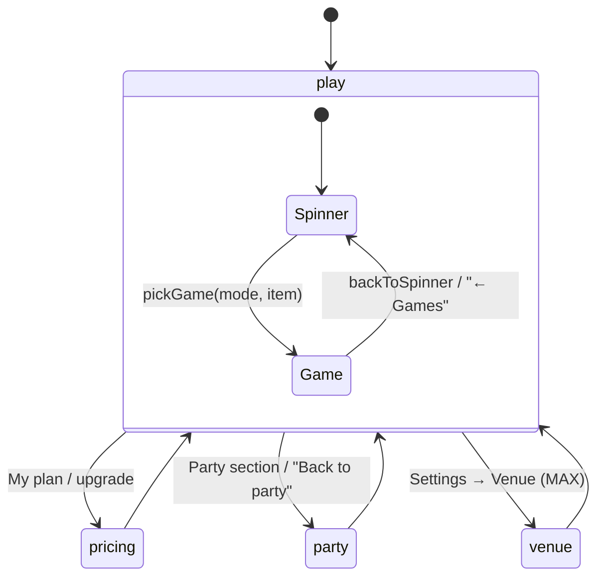
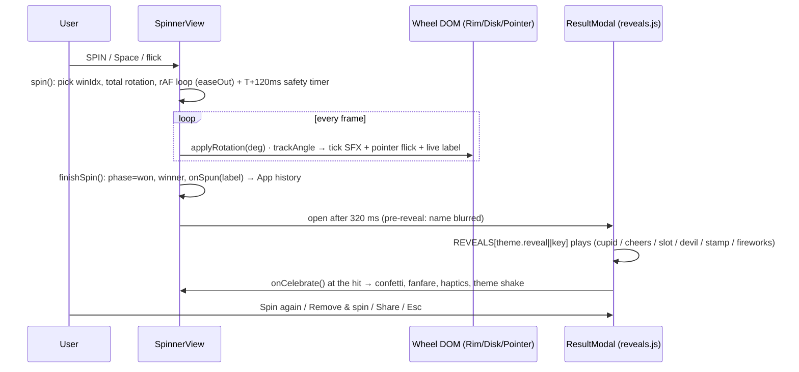
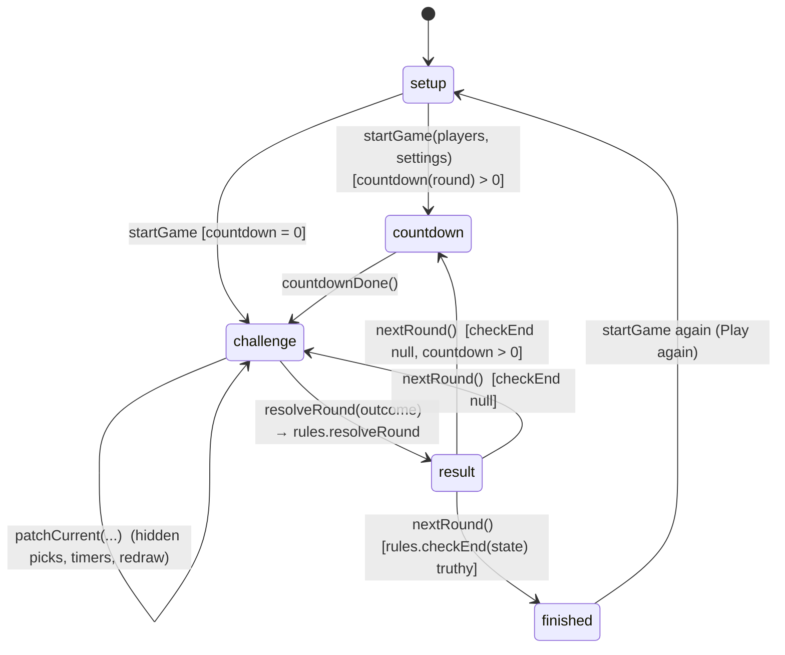
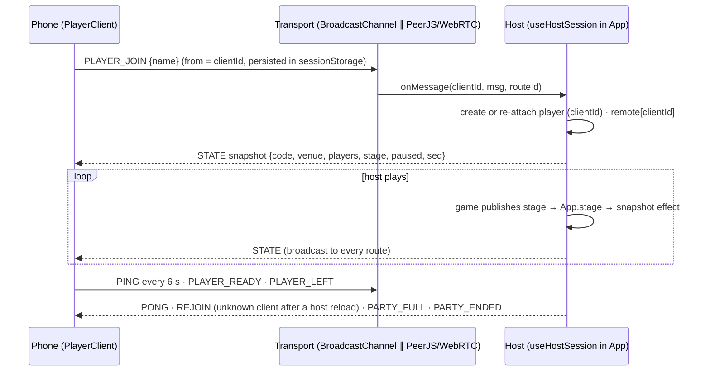
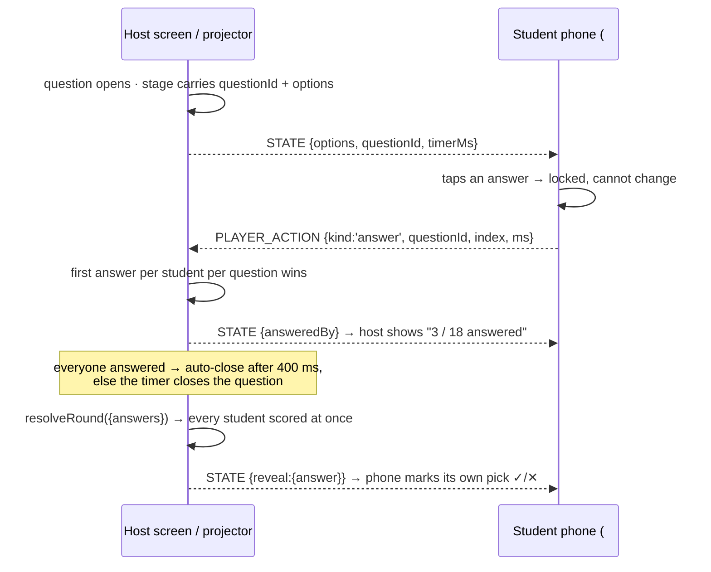

# JParty — architecture & flows

Companion to `CLAUDE.md` (conventions) and `README.md` (features). This document explains **how the app is wired** and ends with a **complete index of every top-level symbol per file** (generated by reading each file and verified against a grep of its declarations).

## 1. Boot

```mermaid
flowchart LR
  A[index.html] --> B[Tailwind CDN · React 18 · Babel standalone · canvas-confetti]
  B --> C[js/engine/util.js<br/>constants, helpers, React hooks destructure]
  C --> D[js/data/*<br/>themes · i18n · challenges · questions · cards · registry]
  D --> E[js/engine/*<br/>audio · effects · random · score · timer · player · gameEngine · session]
  E --> F[js/subscription/plans.js · js/venue/venue.js]
  F --> G[js/components/*<br/>ui · premium · wheel · items · reveals · modals · game · sidebar]
  G --> H[js/realtime/* · js/venue/venueView.js · bigscreen.js]
  H --> I[js/games/*<br/>spinner · party · battle · king · quiz · minigames · cards]
  I --> J[js/app.js → ReactDOM.createRoot]
```



Babel standalone fetches each `<script type="text/babel" src>` and executes them **in document order**. Everything declared at top level is a global, so a file may only reference symbols from files above it (functions are hoisted within a file, not across files). `js/app.js` decides what to mount:

| URL | Mounted root | Purpose |
| --- | --- | --- |
| `/` | `<App />` | the console (host device) |
| `/#join=CODE` | `<PlayerClient code />` | a phone that scanned the QR |
| `/#bigscreen` | `<BigScreenWindow />` | TV window mirroring the host over BroadcastChannel |
| `/#w=…` | `<App />` + shared wheel import | share-link for a spinner list (`readSharedWheel`) |

`sw.js` caches the shell (network-first with `cache: 'no-cache'`) and CDN libs (cache-first) for offline use.

## 2. App state and routing (`js/app.js`)

All persistent state lives in one `localStorage` key (`party_spinner_v1`, see `saveState`/`loadState`):

| Slice | Owner | Notes |
| --- | --- | --- |
| `lang, themeKey, soundOn, haptics, eliminate, duration` | App | settings |
| `items, eliminated, history, lists` | App → `SpinnerView` | spinner list, removed items, spin history, saved wheels |
| `activeGame` | App | what the main area shows (`openModes` is session-only: the accordion opens fully collapsed every time the sidebar opens) |
| `session` | App | `{ players, history, stats }` — the party (see §5) |
| `subscription` | App | `{ plan, status, expiresAt }` (see §6) |
| `venue` | App | branding + venue mode settings (see §7) |
| `hostRoom` | App | current realtime room code, read by `BigScreenWindow` |

Routing is two orthogonal values:



- `screen ∈ {play, party, pricing, venue}`; `bigScreen` is an overlay on top.
- Inside `play`, `activeGame = { mode, id }`. `mode === 'spinner'` renders `SpinnerView`; otherwise `findGame()` resolves the registry item and `gameComponents()[item.component]` renders it inside `GameErrorBoundary` with a `ctx` object (see §4). Unknown components fall back to `GamePlaceholder`.
- `pickGame(mode, item, locked)`: locked → `UpgradeModal`; theme → switch theme and stay on the spinner; game → set `activeGame`, bump `gameRun` (remount), close the sidebar.
- Keyboard: `Esc` closes the topmost layer (upgrade modal → sidebar → big screen → party mode); `F` party mode; `M` mute. Space/Enter are handled inside `SpinnerView` and only when `keysBlocked` is false.

## 3. Spinner flow (`js/games/spinner.js`, unchanged behaviour)



Elimination mode removes the winner (`removeWinner`) on close/spin-again; the last remaining item triggers `t.lastStanding`. `publish` feeds the big screen (`§8`).

## 4. Game engine (`js/engine/gameEngine.js`)

Every game is a React component `({ ctx })` that owns a `rules` object and drives one state machine:



`rules = { countdown(round) → seconds, buildRound(state) → current, resolveRound(state, outcome) → { players, result, settings? }, checkEnd(state) → winner | null }`

- `state = { status, players, settings, round, current, lastResult, history, winner }`. `players` are **per-game copies** (`Score.resetForGame`) of the party players; `Score.*` helpers are pure and return new arrays.
- `current` is whatever `buildRound` returns (participants, challenge, picks, queue, phase…); games mutate it with `patchCurrent`.
- `engine.pendingWinner` lets the result screen label the button "Finish" vs "Next round".
- `ctx` (built in `App`): `{ t, lang, mode, item, meta, modeTitle, players, setPlayers, sfx, haptics, theme, celebrate, showToast, publish, onExit, onChangeGame, onBackToParty, onFinish }`.

How each game maps onto the engine:

| Game | buildRound | outcome → resolveRound | checkEnd |
| --- | --- | --- | --- |
| Battle quick/bo3 | both players + duel challenge (bag) | `{winnerId}` or `{tie}` → win/loss/points | wins ≥ ⌈bestOf/2⌉ (bo3: 2) |
| Battle streak | rotating player + solo challenge | `{success}` → streak ±, milestone at goal | round ≥ rounds → best streak |
| Battle team | random scope (duel/solo/all), reps per team | `{team}` → team score in `settings.teamScores` | team score ≥ goal → `{team, players}` |
| Battle elimination | pairs from `Random.pairs`, queue carried in `current` | `{winnerId}` → loser eliminated | one active player left |
| King (3 variants) | king/challenger/reign/queue carried in `current`; `challenge` variant offers 3 options | `{winnerId}` → defended or new king; `last` eliminates losing challengers | rounds reached / only the king left |
| Quiz | rotating player, question from bag, `phase: handoff→question` | `{answer, ms}` → +100 + speed bonus, per-player stats in `settings.stats` | round ≥ count → leaders |
| RPS | `phase: a → b → reveal` (hidden picks) | `{a, b}` → winner / tie | wins ≥ goal |
| 5 Second / Word (`TimedPromptGame`) | rotating player, prompt, `phase: ready→timing→judge` | `{success}` → points + streak | round ≥ players × perPlayer |
| Don't Laugh | performer/judge swap each round | `{laughed}` → performer or judge wins | rounds reached |
| Reaction | one attempt per round, `phase: ready→wait→go` | `{ms, falseStart}` → `bestMs` | all attempts done → fastest |
| Memory | one board per player, cards/open/attempts in `current` | `{attempts, ms}` → points | every player played |
| Cards | current player from `settings.order/idx/dir/forcedTarget`, card from bag | `done/skip/shield/effect` → points ×multiplier, wild/chaos effects mutate `settings` | round ≥ count |

## 5. Party session (`js/engine/sessionEngine.js`)

`session = { id, createdAt, players[], history[], stats{playerId → {games, wins, points, bestStreak}} }`. Players are created by `createPlayer` (unique colour/avatar). Each game calls `useRecordOnFinish(status, () => gameResultEntry(modeId, gameId, players, winners, summary), ctx.onFinish)` exactly once when it reaches `finished`; `App.finishGame` → `recordGame(session, entry)` updates history (max 100) and stats. `PartyView` manages players and shows `sessionSummary`.

## 6. Plans and entitlements (`js/subscription/plans.js`, `js/components/premium.js`)

```
subscription = { plan: 'free' | 'pro' | 'max', status, expiresAt }
FEATURES      = { 'basic-spinner': 'free', 'advanced-themes': 'pro', king: 'pro', cards: 'pro', 'venue-branding': 'max', 'realtime-sync': 'max', … }
Entitlements  = { isFree, isPro, isMax, hasFeature(sub, id), canPlay(sub, item), requiredPlan(item), upgradeFor(sub, min) }
```

- Each registry item carries `plan`; the sidebar computes `locked = !Entitlements.canPlay(sub, item)` and renders `PlanBadge` (+🔒). Locked items stay visible.
- `App.pickGame` opens `UpgradeModal({ plan, meta })` for locked items; `openVenue`/`toggleBigScreen` do the same for MAX features. Nothing is shown mid-game.
- `doUpgrade(plan)`: `IS_DEV` → set the plan (dev switcher); production → "payments coming soon" toast. **No payment provider is integrated.**
- A plan downgrade falls back from locked themes/games/screens (effect in `App` keyed on `sub`).

## 7. Venue branding (`js/venue/*`)

`venue = { enabled, name, tagline, logo (data URL ≤512px), primary, secondary, maxPlayers, table, … }`. `brandingActive(sub, venue)` requires MAX + enabled + a name; then `Header`/sidebar show logo + name + "powered by JParty", `applyBrandVars` sets `--brand-primary/--brand-secondary/--brand-accent` (used as accents only: `.brand-accent`, result buttons, background blobs). `processLogoFile` validates type/size/dimensions and downsizes via canvas.

## 8. Realtime (`js/realtime/*`) — host is authoritative



- `createHostTransport(code)` opens `BroadcastChannel('pg-'+code)` and a PeerJS peer `pg-<code>-host`; `createPlayerTransport` connects to both. Routes are keyed per connection, identity per message (`from`), so one phone on two routes is one player.
- Snapshot shape (`useHostSession.snapshot`): `{ type:'STATE', seq, ts, code, paused, venue?, players[{id,name,avatar,color,score,eliminated,remote,ready,online}], stage?, onlineCount }`; `stage` is what a game `publish`ed: `{ icon, title, status, round, total, participants, roles, challenge, timerMs, scores, winner, winnerLabel }`.
- Reconnect: phones keep `clientId` in `sessionStorage`; a reloaded host reopens the same code (flag `pg-host` in the host tab's `sessionStorage`) and re-attaches players by `clientId`. Phones that are silent for 25 s show as offline; phones show "Reconnecting…" after 15 s without host messages and re-send JOIN.
- `BigScreen` (overlay) and `BigScreenWindow` (`#bigscreen`, joins with `screen: true` and is never added as a player) render `StageView`.

## 9. Development workflow & gotchas

- Serve over HTTP; after editing JS/CSS bump `?v=` in `index.html` (stale XHR cache otherwise).
- The Tailwind CDN generates classes lazily: measuring layout in the first frame of a brand-new UI can read unstyled sizes — `ResultModal` waits until its stage has height before aiming actors.
- `requestAnimationFrame` pauses in background tabs: the spinner has a wall-clock safety timer; game timers (`useTimer`) are rAF-based and meant for the visible host screen.
- In browser automation, navigating to a URL that differs only by `#hash` does not reload the page.
- `IS_DEV` is true on localhost or with `?dev=1`; `window.__pgDebug` / `window.__pgClient` expose live state there.

---

## 13. Creator: Question Bank → Game → Session

```mermaid
flowchart LR
  subgraph CONTENT["CONTENT · js/content/store.js (IndexedDB)"]
    Q[questions<br/>bilingual, type, difficulty,<br/>topic, imageId, timeSec?]
    IMG[(images<br/>Blobs)]
    Q -.-> IMG
  end
  subgraph CONFIG["CONFIGURATION"]
    G[games<br/>questionIds[] · config<br/>timer · points · teams · randomisation]
  end
  subgraph LIVE["LIVE SESSION (unchanged)"]
    T[quiz theme<br/>custom:gameId]
    E[useGameEngine<br/>setup→countdown→challenge→result→finished]
    S[session · players · teams · scores]
  end
  Q -->|by ID, never copied| G
  G -->|customGames.js| T --> E --> S
```

- **One question, many games.** A game stores IDs, so Duplicate creates a new game pointing at the same questions; editing the copy never touches the original. Deleting a question removes it from every game that referenced it.
- **One engine, one mode.** A custom game becomes a quiz theme (`custom:<gameId>`) and is registered under `GAME_REGISTRY.quiz.games`, so it appears in the Quiz accordion right after Animals / Flags / Representative Animals / Mix, and `QuizGame`, the state machine, the scoreboard and the result screen are shared. There is no separate "My Games" or "classroom" mode; My Games / Question Bank / Create game are screens reached from the Quiz accordion footer.
- **Timers** resolve per question: `question.timeMs ?? game.config.timerSec`. `0` means no limit (the ring is replaced by an ∞ badge and the round never auto-submits).
- **Teams** are a player grouping, not a scoring system: a team's score is the sum of its members', computed from the same `Score` helpers (`TeamScores` in `js/components/game.js`).
- **Persistence is local and honest**: images are real Blobs in IndexedDB on that device. Nothing is uploaded; `ContentStore` is the only module that knows this, so a server can replace it later without touching the UI.

### 13.1 Live classroom (students answer on their phones)



Hot-seat and live are the **same game**: `buildRound` returns `playerId: null, live: true` when phones are connected, and `resolveRound` scores the whole class in one pass instead of one player. Speed bonus uses each student's own `ms`. Host controls (Reveal / Skip / Restart) work in both.

---

## 14. Party classics added on the existing engines

| Game | File | Engine shape | Notes |
|---|---|---|---|
| Most Likely To · Never Have I Ever · Would You Rather | `js/games/votecards.js` | one card per round, no single player; host records the table's answer in `cur.picks`, `resolveRound` scores everyone at once | `rather`: majority +1, minority owes a dare, tie scores nobody |
| Charades | `js/games/partygames.js` | hot-seat actor, `useTimer`, ✓/⏭ patch the round, timeout resolves | word shown only to the actor; big screen gets `🎭 Guess the word · n ✓` |
| Pass the Bomb | `js/games/partygames.js` | hidden fuse 20–45 s via `useTimer`, PASS rotates `holderIdx`, explosion resolves | holder loses, everyone else +1; fuse length never rendered |
| Imposter | `js/games/partygames.js` | phases pass → discuss → vote; `Random.player` picks the imposter | caught → crew +1 (+1 to imposter if they still guess the word); escaped → imposter +2 |

All of them reuse `useMiniSetup` / `MiniSetup` / `NextButton` / `useMiniStage` from `minigames.js`, so `partygames.js` and `votecards.js` load after it.

---

## 10. Symbol index (every top-level declaration, per file)

<!-- INDEX:BEGIN -->
_39 files · 249 top-level symbols. Each file was read by one agent and independently cross-checked against `grep` of its declarations by another; the check added 0 missed entries and corrected 38 descriptions (marked *verified*)._

### `js/engine/util.js`

Foundation module for the no-build React party-spinner app: destructures React hooks into globals, defines app-wide constants/limits, and provides pure helpers (math, random, string, wheel geometry, color, formatting, share-URL encoding, clipboard, vibration) plus localStorage persistence used by every other file.

| Symbol | Kind | Signature | What it does |
| --- | --- | --- | --- |
| `useState` | const | `React.useState` | React hook re-exported as a global via destructuring from React. — uses `React` |
| `useEffect` | const | `React.useEffect` | React hook re-exported as a global. — uses `React` |
| `useLayoutEffect` | const | `React.useLayoutEffect` | React hook re-exported as a global. — uses `React` |
| `useReducer` | const | `React.useReducer` | React hook re-exported as a global. — uses `React` |
| `useRef` | const | `React.useRef` | React hook re-exported as a global. — uses `React` |
| `useMemo` | const | `React.useMemo` | React hook re-exported as a global. — uses `React` |
| `useCallback` | const | `React.useCallback` | React hook re-exported as a global. — uses `React` |
| `memo` | const | `React.memo` | React.memo re-exported as a global. — uses `React` |
| `STORAGE_KEY` | const | `'party_spinner_v1'` | localStorage key used by loadState/saveState. |
| `APP_VERSION` | const | `'1.1'` | App version string. |
| `MAX_ITEMS` | const | `100` | Max wheel items accepted by parseLines/readSharedWheel. |
| `MAX_ITEM_LEN` | const | `60` | Max characters per item (used by clip). |
| `MAX_HISTORY` | const | `50` | Max spin-history entries kept. |
| `MAX_SAVED` | const | `30` | Max saved wheels. |
| `MIN_DURATION` | const | `3` | Minimum spin duration (seconds). |
| `MAX_DURATION` | const | `30` | Maximum spin duration (seconds). |
| `REDUCED_MOTION` | const | `boolean` | True if the OS prefers-reduced-motion media query matches at load (false if unsupported). |
| `mod` | function | `(a, n) → number` | Always-positive modulo. |
| `clamp` | function | `(v, lo, hi) → number` | Clamps v into [lo, hi]. |
| `rand` | function | `() → number in [0,1)` | Random float using crypto.getRandomValues, falling back to Math.random. |
| `randInt` | function | `(n) → integer in [0,n)` | Random integer below n using rand(). |
| `shuffleArr` | function | `(arr) → new array` | Fisher-Yates shuffle returning a copy. |
| `clip` | function | `(s) → string` | Trims and truncates a string to MAX_ITEM_LEN. |
| `parseLines` | function | `(text) → string[]` | Splits textarea text by newline, clips each, drops empties, caps at MAX_ITEMS. |
| `truncate` | function | `(s, n) → string` | Truncates s to n chars with an ellipsis if longer. |
| `sameList` | function | `(a, b) → boolean` | Shallow element-wise array equality. |
| `isSampleList` | function | `(list) → boolean` | True if list equals any built-in sample list (SAMPLE_ITEMS[lang][theme]). *(verified: Signature OK, but it depends on global SAMPLE_ITEMS (defined in another file, shape {theme: {lang: string[]}}); returns true if list matches any sample list via sameList. Add dependsOn: ["SAMPLE_ITEMS", "sameList"].)* — uses `SAMPLE_ITEMS` |
| `uid` | function | `() → string` | Short unique id from base36 timestamp + random suffix. |
| `easeOut` | function | `(p) → number` | Cubic ease-out easing for spin animation (p in 0..1). |
| `polar` | function | `(cx, cy, r, deg) → {x, y}` | Polar to cartesian; 0° is top of wheel, clockwise positive. |
| `sectorPath` | function | `(cx, cy, r, startDeg, endDeg) → SVG path string` | Builds an SVG pie-sector path for a wheel segment. |
| `indexAt` | function | `(rotation, n) → segment index` | Index of the segment under the top pointer for a given wheel rotation (degrees). |
| `luminance` | function | `(hex) → number 0..1` | Relative luminance of a '#rrggbb' colour (sRGB linearised). |
| `textOn` | function | `(hex) → '#1b1b1f' \| '#ffffff'` | Picks dark or light text colour for a background hex (threshold 0.42). |
| `segColor` | function | `(palette, i, n) → hex` | Cycles palette colours for segment i of n, avoiding first/last segment sharing a colour. |
| `tdKind` | function | `(label) → 'dare' \| 'truth' \| null` | Classifies a Truth-or-Dare label by regex (EN/VI keywords). |
| `fmtAgo` | function | `(ts, lang) → string` | Relative time string ('2 minutes ago') via Intl.RelativeTimeFormat; falls back to toLocaleTimeString; '' if no ts. |
| `b64url` | const | `{ enc(str) → string, dec(s) → string }` | URL-safe base64 encode/decode of UTF-8 strings (used for share links). |
| `readSharedWheel` | function | `() → { items, theme } \| null` | Parses #w=<b64url JSON {i: items[], t: theme}> from location.hash; validates items and theme key against THEMES. *(verified: Depends on global THEMES (other file) to validate data.t; returns { items: string[], theme: string \| null } \| null — theme is null when data.t is not a known THEMES key. Parses location.hash '#w=<b64url JSON {i: string[], t: string}>'. Add dependsOn: ["THEMES"].)* — uses `THEMES` |
| `baseUrl` | function | `() → string` | Current URL without the hash fragment. |
| `copyText` | function | `async (text) → boolean` | Copies text via navigator.clipboard, falling back to hidden textarea + execCommand('copy'). |
| `vibrate` | function | `(pattern) → void` | navigator.vibrate wrapper; no-op until user has interacted (userActivation) and swallows errors. |
| `loadState` | function | `() → object` | Reads and JSON-parses persisted state from localStorage[STORAGE_KEY]; {} on error/missing. |
| `saveState` | function | `(state) → void` | JSON-stringifies state into localStorage[STORAGE_KEY]; errors swallowed. |

> **Note:** Must be loaded before every other script: it defines the React hook globals (useState etc.) and constants everyone uses. It also references SAMPLE_ITEMS and THEMES, which are defined in other files; these are only used inside function bodies (isSampleList, readSharedWheel), so load order relative to those files only matters at call time, not at load time. REDUCED_MOTION is evaluated once at load and does not react to later OS changes. Share-link format: hash w= carrying b64url JSON with keys i (items) and t (theme key).


### `js/data/themes.js`

Pure data file: defines the 6 wheel themes (visual config + monetisation flags), their en/vi display text, per-theme sample wheel items, and the Truth-or-Dare prompt pools. No functions; everything is a plain object literal consumed by other files as globals.

| Symbol | Kind | Signature | What it does |
| --- | --- | --- | --- |
| `THEMES` | const | `{ drinking, lucky, truth_or_dare, dating, office } → each { key, icon, free, plan?, skin?, reveal?, palette[6], bgGradient, themeColor, accent, pointerColor, btnClass, resultEmoji, effect, floaters[], confettiColors[] }` | Registry of wheel themes keyed by id; drinking/lucky/truth_or_dare are free, dating/office/hardcore are PRO; a theme may set `skin`/`reveal` to reuse another theme's wheel skin and reveal; effect is one of shake\|confetti\|glow\|hearts\|clean\|flash. |
| `THEME_TEXT` | const | `{ en: { <themeKey>: { name, tagline, kicker } }, vi: { ... } }` | Localised display strings (name, tagline, result kicker) for every THEMES key, in English and Vietnamese. |
| `SAMPLE_ITEMS` | const | `{ en: { <themeKey>: string[] }, vi: { <themeKey>: string[] } }` | Default wheel segment labels per theme and language (6-10 items; lucky is '1'..'10', office is sample people names). |
| `TD_PROMPTS` | const | `{ en: { truth: string[14], dare: string[14] }, vi: { truth: string[14], dare: string[14] } }` | Truth-or-Dare prompt pools (14 truths + 14 dares) per language, used when a truth_or_dare spin resolves. |

> **Note:** All four objects are indexed by the same theme keys and by lang 'en'/'vi'; adding a theme requires adding entries to THEMES, THEME_TEXT (both langs) and SAMPLE_ITEMS (both langs) or lookups will be undefined. Pro themes (friends/college/sports) carry extra fields plan/skin/reveal that the other six do not; reveal references another theme key, so consumers must not assume it's self-referential. office.floaters is an empty array (effect 'clean'). File has no dependencies on other globals and declares no functions.


### `js/data/i18n.js`

Defines all UI strings for the app in two locales (en / vi) as the global I18N dictionary, plus the LANGS list used by the language picker. Consumers select a locale object with I18N[lang] (conventionally bound to t) and read keys directly.

| Symbol | Kind | Signature | What it does |
| --- | --- | --- | --- |
| `I18N` | const | `{ en: {...}, vi: {...} } — each locale object has identical key sets. Values are either strings, template functions, or nested objects. Key groups: Spinner shell (appName, openMenu, close, spin, spinning, spinHint, needTwo, itemsCount(n,d), items, quickAdd, add, shuffle, sort, dedupe, numbers, sample, clear, bulkEdit, done, bulkPlaceholder, emptyList, fillNumbers, fill, restoreRemoved(n), removeItem(x)); Sidebar/Settings (themes, pro, settings, sound, soundDesc, haptics, hapticsDesc, eliminate, eliminateDesc, duration, language, myWheels, saveCurrent, namePlaceholder, save, load, del, noWheels, itemsShort(n), history, clearHistory, noHistory, topPicks, totalSpins(n), shortcuts, scSpin, scParty, scMute, scClose, account, unlockPro, unlockProDesc, loginSoon); Result/Reveal (winnerIs, modeLabel(n), spinAgain, removeAndSpin, removeOnly, eliminatedNote, share, copied, truth, dare, another, proTitle, proBody, gotIt, partyMode, exitParty, shareWheel, linkCopied, loadedShared, muted, unmuted, undo, cleared, removed(x), lastStanding(x), saved(x), loaded(x), deleted(x), maxReached, dupesRemoved(n), shuffled, stampText, jackpot, cheers, devilSays, tapToSkip, poweredBy); JParty panel (panelTitle, gameModes, themesLabel, gamesLabel, comingSoon, comingSoonBody, backToSpinner, pickAnother, gameInfo, availableWith(p), games, games2, players, addPlayer, playerName, needPlayers(n), shuffleOrder, start, startGame, round, nextRound, finish, playAgain, changeGame, backToParty, gameComplete, winner, winners, tie, challenge, newChallenge, whoWon, success, failed); Scoring (points, pts, winsLabel, streakLabel, bestStreakLabel, eliminatedLabel, isOut(n), lastPlayerStanding, bye(n)); Battle (vs, format, bestOf(n), roundsLabel, streakGoal, firstTo(n), teamRed, teamBlue, autoTeams, wholeTeam, milestone(n), pointTo(n)); King (king, challenger, kingStays, newKing, defenses, longestReign, kingOfNight, pickChallenge, reign(n)); Quiz (questions, question, correct, wrong, timeUp, speedBonus, accuracy, fastest, quizComplete, passTo(n), yourTurn(n), next, didYouKnow, correctAnswer); Mini games (rock, paper, scissors, chooseSecretly(n), lockedIn, reveal, category, letter, performer, judge, laughed, survived, rolesSwap, wait, go, tapWhenGreen, tapToStart, falseStart, attempt, reactionLabels{incredible,fast,good,slow}, best, attempts, pairs, time, difficulty, difficultyLabels{easy,medium,hard}, memorize, allMatched); Cards (drawCard, skip, useShield, cardsLeft(n), chooseTarget, shieldsLabel, turnOrder, effectApplied, extraTurn, doubleOn, everyoneTurn, reversed, swapped, targetIs(n), shieldGained, turnOf(n), nonDrinking, showOriginal, drinkNote); Party session (party, partySummary, gamesPlayed, mostWins, longestStreak, mostPlayed, mostPoints, gameHistory, noGames, newParty, newPartyConfirm, managePlayers, wonBy(n), playersAtTable(n), scoringLabels{points,streak,elimination,time,none}, playersRange(a,b), includeHint, playing); Plans/Subscription (plan, myPlan, currentPlan, upgradeTo(p), maxActive, choosePlan, maybeLater, paymentsSoon, devSwitched(p), devSwitcher, comparePlans, planTag{free,pro,max}, planCards{free[],pro[],max[]}, upgrade{pro{title,body,perks[]},max{title,body,perks[]}}, compare{basicSpinner,basicThemes,advancedThemes,basicBattle,advancedBattle,king,quiz,advancedQuiz,miniGames,advancedMini,cards,customItems,customLogo,venueName,venueMode,qrJoin,realtime,hostMode,bigScreen,venueStats}); Venue/Realtime (venue, venueMode, venueBranding, venueName, venueLogo, uploadImage, removeLogo, taglineLabel, brandColor, secondaryColor, preview, poweredByPG, enableBranding, bigScreen, qrJoin, maxPlayersLabel, tableLabel, startParty, endParty, generateQr, newCode, room, scanToJoin, joinParty, yourName, join, joined, waitingHost, connected, reconnecting, disconnected, hostControls, pause, resume, restart, clearPlayers, logoErrors{type,size,small}, venueSaved, youAreUp, spectating, ready, readyCount(a,b), remotePlayers, sameDeviceOnly, openBigScreen, exitBigScreen, venueStats, partyCode, orEnterCode, noParty, leave, hostLeft, paused, livePlayers); Misc (footer, shareText(w))` | Locale dictionary of every UI string for EN and VI; consumed as const t = I18N[lang] in app.js, realtime/player.js and venue/bigscreen.js. *(verified: Index omits external dependencies: I18N depends on globals from other files — MAX_ITEMS (js/engine/util.js:9, used eagerly in maxReached template literals at lines 50/128, so util.js must load before i18n.js) and PLAN_LABEL (js/subscription/plans.js:8, used lazily inside the availableWith(p), upgradeTo(p), devSwitched(p) template functions). Also note: the key done is declared twice in each locale (Spinner shell line 17/95 and Cards line 67/145, same value); the Cards key group in the index should include done or the duplicate should be flagged. Otherwise key groups and en/vi parity verified accurate.)* — uses `MAX_ITEMS (js/engine/util.js) — used eagerly in maxReached`, `PLAN_LABEL (js/subscription/plans.js) — used lazily inside availableWith(p), upgradeTo(p), devSwitched(p)` |
| `LANGS` | const | `[{ key: 'en', label: 'English' }, { key: 'vi', label: 'Tiếng Việt' }]` | Ordered list of selectable languages; rendered by the language picker in js/components/sidebar.js (LANGS.map). Keys must match top-level keys of I18N. |

> **Note:** 1) Load order (index.html): util.js loads before i18n.js, so MAX_ITEMS is safe to use eagerly in maxReached. plans.js loads AFTER i18n.js, so PLAN_LABEL is only safe because it is referenced inside arrow functions (availableWith, upgradeTo, devSwitched) that run at render time — do not use PLAN_LABEL (or anything from later files) at the top level of I18N. 2) When adding a key, add it to BOTH en and vi; there is no fallback to English for a missing vi key, so a missing key renders undefined. 3) Value types are mixed: plain strings, template functions (e.g. itemsCount(n,d), playersRange(a,b)), and nested objects (reactionLabels, difficultyLabels, scoringLabels, planTag, planCards, upgrade, compare, logoErrors) — callers must know which shape they are reading. 4) The key done is declared twice in each locale (line 17 and line 67, same value); the later one wins silently. Several keys (venueName, venueMode, bigScreen, qrJoin, venueStats) exist both at top level and inside compare with slightly different wording — intentional, not a bug. 5) app.js guards the initial language with I18N[initialLang] ? initialLang : 'en'; adding a new locale requires a new I18N entry plus a LANGS entry.


### `js/data/challenges.js`

Static, bilingual (en/vi) content banks for the party mini-games: Battle/King/Cards challenge list plus prompt lists for the 5-second, don't-laugh and word-chain games. Pure data, no logic.

| Symbol | Kind | Signature | What it does |
| --- | --- | --- | --- |
| `CHALLENGES` | const | `{ en: Challenge[], vi: Challenge[] } where Challenge = { id: 'c01'..'c30', scope: 'duel'\|'solo'\|'all', text: string, drink?: true, alt?: string }` | 30 challenges per language (16 duel, 9 solo, 5 all); ids match across en/vi; drink:true entries always carry an alt non-drinking text. |
| `FIVE_SECOND_PROMPTS` | const | `{ en: string[24], vi: string[24] }` | 'Name 3 ...' prompts for the five-second game, index-aligned between languages. |
| `DONT_LAUGH_PROMPTS` | const | `{ en: string[8], vi: string[8] }` | Prompts telling a player how to make an opponent laugh for the don't-laugh game. |
| `WORD_CATEGORIES` | const | `{ en: string[12], vi: string[12] }` | Category names for the word game (e.g. Beer brands, Animals, Countries). |
| `WORD_LETTERS` | const | `string = 'ABCDGHKLMNPST'` | Allowed starting letters for the word game (letters that work in both English and Vietnamese). |

> **Note:** All five names are globals consumed by other files (Battle/King/Cards and the mini-game components); no code here, only data. Challenge ids are shared across en/vi so consumers should look up by id and current language. Every drink: true challenge must keep an alt field — UI relies on it to offer a non-drinking option. vi FIVE_SECOND_PROMPTS is a loose translation (e.g. 'pasta' became 'bún/phở'), not literal.


### `js/data/questions.js`

Static quiz question bank (bilingual en/vi) for the quiz game mode, plus a helper to filter questions by category. Pure data; no React, no dependencies on other files.

| Symbol | Kind | Signature | What it does |
| --- | --- | --- | --- |
| `QUESTIONS` | const | `Array<{ id, cat: 'general'\|'beer'\|'music'\|'movies'\|'sports', diff: 'easy'\|'medium'\|'hard', q: {en, vi}, options: {en: string[4], vi: string[4]}, a: number, why?: {en, vi} }>` | 42 quiz questions (9 general, 9 beer, 8 music, 8 movies, 8 sports); a is the index of the correct option; why is an optional explanation shown after answering. |
| `questionsFor` | function | `questionsFor(category: string) → question[]` | Returns the full QUESTIONS array when category === 'random', otherwise QUESTIONS filtered by cat === category (empty array for unknown categories). *(verified: questionsFor(category: 'random' \| 'general' \| 'beer' \| 'music' \| 'movies' \| 'sports') → question[] — returns the full QUESTIONS array when category === 'random', otherwise filters by q.cat === category (unknown categories return []). Declared as an arrow-function const, not a function declaration.)* |

> **Note:** File has no dependencies on other globals and nothing else in it; it must be loaded before whatever quiz engine calls questionsFor/QUESTIONS. Category ids ('general','beer','music','movies','sports','random') and the 4-option/index-answer shape are implicit contracts with the quiz UI and any I18N category labels. Question ids follow prefix convention g/b/m/f/s + two digits; keep them unique if the engine tracks asked questions by id.


### `js/data/cards.js`

Static card deck data for the cards game: bilingual (en/vi) challenge, truth, dare, wild and chaos cards, per-type display metadata, and a helper that assembles a deck for a given deck key and language.

| Symbol | Kind | Signature | What it does |
| --- | --- | --- | --- |
| `CARD_CONTENT` | const | `{ challenge \| truth \| dare \| wild \| chaos : { en: Card[], vi: Card[] } } where Card = { id, title, content, difficulty?: 'easy'\|'medium'\|'hard', drink?: true, alt?: string, effect?: string }` | Raw card text per type and language; 10 cards each for challenge/truth/dare, 5 each for wild (effects: respin, target, shield, switch, double) and chaos (effects: everyone, swap, reverse, doubleRound, randomTarget). Same ids across en/vi. *(verified: Card is really a union of two shapes: regular cards (challenge/truth/dare) = { id, title, content, difficulty: 'easy'\|'medium'\|'hard', drink?: true, alt?: string } and effect cards (wild/chaos) = { id, title, content, effect: string } with no difficulty. Effect values: wild → 'respin'\|'target'\|'shield'\|'switch'\|'double'; chaos → 'everyone'\|'swap'\|'reverse'\|'doubleRound'\|'randomTarget'. ids are shared across en/vi (same id, translated text). 10 cards per regular type, 5 per effect type; drink/alt only appear on ch08.)* |
| `CARD_TYPE_META` | const | `{ challenge \| truth \| dare \| wild \| chaos : { icon: string, color: string } }` | Emoji icon and hex color used to render each card type. |
| `buildDeck` | function | `buildDeck(deckKey: 'challenge'\|'truth'\|'dare'\|'wild'\|'chaos', lang: 'en'\|'vi') → Array<Card & { type }>` | Returns the card list for a deck: 'wild' = challenge + dare + wild x2, 'chaos' = challenge + dare + chaos x2, otherwise just that type's cards; each card gets a type field. *(verified: Declared as const buildDeck = (deckKey, lang) => ... (arrow function assigned to const, not a function declaration). Signature should describe deck composition: 'challenge'\|'truth'\|'dare' → that type's cards; 'wild' → [...challenge, ...dare, ...wild, ...wild]; 'chaos' → [...challenge, ...dare, ...chaos, ...chaos] (effect cards included twice). Each card is spread with type set to its SOURCE type (e.g. a 'wild' deck contains cards with type 'challenge', 'dare' and 'wild'), not the deckKey. Depends on CARD_CONTENT only; no validation — unknown deckKey or lang throws.)* |

> **Note:** Pure data file, no dependencies on other globals. Wild/chaos effect cards are included twice in their decks (duplicate ids) so dedupe by id is unsafe. Only 'en' and 'vi' are present; buildDeck throws for any other lang or an unknown deckKey (CARD_CONTENT[type] undefined). Effect strings are consumed by js/games/cards.js which applies them as state changes. drink: true cards carry an alt non-drinking text.


### `js/data/registry.js`

Single source of truth for every playable mode/game/theme in the app: ids, icons, plan (free/pro), host component + variant, player range, duration, scoring, difficulty, plus en/vi titles, descriptions and how-to-play text. Drives the sidebar, info popovers, entitlements and the game host.

| Symbol | Kind | Signature | What it does |
| --- | --- | --- | --- |
| `GAME_REGISTRY` | const | `{ spinner, battle, king, quiz, minigames, cards } → each { id, icon, accent, type: 'themes'\|'games', games: { [gameId]: { id, icon, plan, component, variant?\|category?\|deck?, players: [min,max], duration, scoring, difficulty } } }` | Static registry of all 6 modes and their games; spinner.games is generated from THEMES (one entry per theme key, component 'spinner'). Game ids: quick-battle, best-of-3, streak-battle, team-battle, elimination-battle, classic-king, king-challenge, last-king, quiz-general/beer/music/movies/sports/random, rps, five-second, dont-laugh, reaction, memory, word, challenge/truth/dare/wild/chaos-cards. *(verified: Signature is accurate but omit nothing: spinner.games is derived at load time from THEMES (depends on global THEMES from themes data file) — each theme entry gets plan: th.plan \|\| (th.free ? 'free' : 'pro'), component 'spinner', players [1,100], duration '∞', scoring 'none', difficulty 'easy'. Add dependsOn: ['THEMES'].)* — uses `THEMES` |
| `GAME_MODES` | const | `Array<{ ...mode, items: GameDef[] }>` | Array form of GAME_REGISTRY with each mode's games flattened into an items array (for sidebar iteration). |
| `findGame` | function | `(modeId, itemId) → { mode, item } \| null` | Looks up a mode and game def in GAME_REGISTRY; null if either is missing. |
| `MODE_TEXT` | const | `{ en: { spinner, battle, king, quiz, minigames, cards: { title, desc } }, vi: {...} }` | Localized title/desc for each of the 6 modes (en, vi). |
| `QUIZ_HOWTO` | const | `{ en: string, vi: string }` | Shared how-to-play text reused by all quiz-* entries in GAME_META_TEXT (15s/question, +100 correct, up to +50 speed bonus). |
| `GAME_META_TEXT` | const | `{ en: { [gameId]: { title, description, howToPlay } }, vi: {...} }` | Localized title/description/howToPlay for every non-theme game id in GAME_REGISTRY (battle, king, quiz, minigames, cards). Themes are not here; they use THEME_TEXT. *(verified: Accurate, but note it covers only 'games'-type entries (battle/king/quiz/minigames/cards, 25 ids per lang); spinner themes are NOT in it — they use THEME_TEXT. Quiz entries' howToPlay reference QUIZ_HOWTO.en/vi.)* |
| `SPINNER_HOWTO` | const | `{ en: string, vi: string }` | How-to-play text used for every spinner theme (add names, SPIN, flick or Space, drinking optional). |
| `gameMeta` | function | `(lang, mode, item) → { title, description, howToPlay, id, icon, plan, players, duration, scoring, difficulty }` | Builds the full localized display metadata for a game or theme; for mode.type 'themes' pulls title/tagline from THEME_TEXT[lang][item.id] + SPINNER_HOWTO, otherwise GAME_META_TEXT[lang][item.id] (falls back to id with empty text). plan defaults to 'free'. *(verified: Depends on globals THEME_TEXT (for mode.type === 'themes', title = THEME_TEXT[lang][item.id].name, description = .tagline, howToPlay = SPINNER_HOWTO[lang]). For games, falls back to { title: item.id, description: '', howToPlay: '' } when GAME_META_TEXT[lang][item.id] is missing; plan defaults to 'free' if item.plan is falsy. Add dependsOn: ['THEME_TEXT'].)* — uses `THEME_TEXT` |
| `gameTitle` | function | `(lang, modeId, itemId) → string` | Convenience: localized title via findGame + gameMeta, falling back to itemId when not found. *(verified: (lang, modeId, itemId) → string; returns itemId itself (not empty) when findGame returns null.)* — uses `THEME_TEXT` |

> **Note:** Load order matters: this file reads THEMES at top level (GAME_REGISTRY.spinner.games) so js/data/themes (THEMES, THEME_TEXT) must be loaded before registry.js. Theme plan is th.plan \|\| (th.free ? 'free' : 'pro'). Game component strings ('spinner','battle','king','quiz','rps','fiveSecond','dontLaugh','reaction','memory','word','cards') are keys the game host maps to React components; variant/category/deck are per-component sub-selectors. Adding a game requires both a GAME_REGISTRY entry and en+vi entries in GAME_META_TEXT, otherwise gameMeta falls back to the raw id with empty description. Only free games: all spinner themes flagged free, quick-battle, quiz-general, rps, five-second, dont-laugh.


### `js/engine/audio.js`

Web Audio synth sound layer with no asset files: lazily creates a shared AudioContext + master gain/compressor, provides low-level tone/sweep/noise primitives, and exposes the SFX registry of named sound effects used by the wheel and themes.

| Symbol | Kind | Signature | What it does |
| --- | --- | --- | --- |
| `_ctx` | const | `let _ctx: AudioContext \| null` | Lazily-created shared AudioContext (module-level state, set by getCtx). |
| `_master` | const | `let _master: GainNode \| null` | Master GainNode (gain 0.9) feeding a DynamicsCompressor to ctx.destination; all primitives connect to it. |
| `getCtx` | function | `getCtx() → AudioContext \| null` | Creates the AudioContext/master chain on first call (webkit fallback), resumes it if suspended, returns null if Web Audio unavailable. |
| `tone` | function | `tone(freq, dur, type='sine', vol=0.18, when=0, glideTo=null) → void` | Plays a single oscillator note with fast attack and exponential decay; optional pitch glide to glideTo over dur; when = offset seconds. |
| `sweep` | function | `sweep(f1, f2, dur, vol=0.12) → void` | Sawtooth oscillator through 1800Hz lowpass, frequency ramps f1→f2 over dur with decaying gain (whoosh). |
| `_noiseBuf` | const | `let _noiseBuf: AudioBuffer \| null` | Cached 1-second white-noise buffer, created on first noise() call. |
| `noise` | function | `noise({ dur=0.3, vol=0.2, type='lowpass', f1=800, f2=f1, q=0.8, when=0 } = {}) → void` | Plays looped white noise through a BiquadFilter (type/q) whose frequency ramps f1→f2 over dur, with attack/decay envelope. |
| `SFX` | const | `SFX = { click, tick, whoosh, land, win, flutter, creak, twang, heartHit, slide, clink, slotTick, jackpot, coin, giggle, charge, fireHit, thud, bell, whistle, boom } (each: () => void)` | Registry of named sound effects built from tone/sweep/noise; generic (click, tick, whoosh, land, win) plus per-theme groups: dating/cupid (flutter, creak, twang, heartHit), drinking/cheers (slide, clink), lucky/slot (slotTick, jackpot, coin), truth-or-dare/devil (giggle, charge, fireHit), office/stamp (thud, bell), hardcore/fireworks (whistle, boom). — uses `rand` |

> **Note:** rand() used by SFX.tick and SFX.slotTick is a global defined in another file (not in audio.js); this file must load after it or those effects throw. AudioContext is created lazily and resumed on each call, so the first sound must be triggered from a user gesture to satisfy browser autoplay policy. tone/sweep/noise silently no-op when getCtx() returns null. All playback goes through _master; there is no volume/mute API exposed here.


### `js/engine/effects.js`

Celebration visual effects: canvas-confetti bursts, floating emoji particles, and a screen flash, plus a dispatcher that picks a combination of these based on a theme's effect key.

| Symbol | Kind | Signature | What it does |
| --- | --- | --- | --- |
| `fireConfetti` | function | `fireConfetti(colors: string[], power = 1) → void` | Fires three staggered canvas-confetti bursts (center, then left and right at 180ms/360ms) scaled by power; no-op if global confetti is not loaded. Sets disableForReducedMotion. — uses `confetti (canvas-confetti CDN global)` |
| `spawnFloaters` | function | `spawnFloaters(emojis: string[], count: number) → void` | Appends count .float-particle divs with a random emoji, left %, font size, animation duration/delay to document.body; each removed after 5s. No-op if REDUCED_MOTION or empty list. — uses `REDUCED_MOTION`, `randInt`, `rand` |
| `flashScreen` | function | `flashScreen() → void` | Appends a .flash-overlay div to body and removes it after 1.3s; no-op when REDUCED_MOTION. — uses `REDUCED_MOTION` |
| `triggerThemeEffect` | function | `triggerThemeEffect(theme: { effect, floaters, confettiColors }) → void` | Dispatches on theme.effect: 'hearts' → 22 floaters + confetti; 'flash' → flashScreen + confetti(1.4) + 10 floaters; 'clean' → confetti(0.5) only; default → confetti + 10 floaters. — uses `theme objects (THEMES registry from another file)` |

> **Note:** Relies on CSS classes .float-particle and .flash-overlay (with their keyframe animations) being defined in the stylesheet; REDUCED_MOTION, rand, randInt are globals defined elsewhere (likely a utils/random file); confetti is the canvas-confetti library loaded via script tag and is guarded with a typeof check so the file is safe if the CDN fails. Effect names handled: 'hearts', 'flash', 'clean', anything else falls to default.


### `js/engine/randomEngine.js`

Shared fair-randomness helpers used by every game: random item/player picking, bracket pairing, a no-repeat "bag" (plus a React hook wrapper), and turn-order stepping that skips eliminated players.

| Symbol | Kind | Signature | What it does |
| --- | --- | --- | --- |
| `Random` | const | `{ item(arr) → elem, shuffle(arr) → arr (= shuffleArr), player(players, { exclude=[], includeEliminated=false }) → player\|null, players(players, count, opts) → player[], target(players, excludeId) → player\|null, pairs(players) → { pairs: [id,id][], bye: id\|null } }` | Registry of random pickers; player/players/target skip eliminated players by default and exclude by id, pairs shuffles active players into bracket pairs with an odd player as bye. *(verified: player(players, { exclude=[], includeEliminated=false } = {}) — the options object itself defaults to {} so player(players) is valid; players(players, count, opts = {}) likewise; pairs only pairs non-eliminated players (shuffled). Depends on randInt, shuffleArr from other files.)* — uses `randInt (js/engine/util.js)`, `shuffleArr (js/engine/util.js)` |
| `createBag` | function | `createBag(items) → { next() → item, reset() }` | Returns a bag that hands out each item once in random order before refilling; avoids repeating the last item across refills. *(verified: createBag(items) → { next() → item, reset() }; next() refills via shuffleArr when empty and avoids repeating the last-returned item across refills (if >1 items); reset() just empties the pool. Depends on shuffleArr.)* — uses `shuffleArr (js/engine/util.js)` |
| `useBag` | hook | `useBag(items, key) → bag ({ next, reset })` | React hook that memoizes a createBag(items) in a ref and rebuilds it whenever key (e.g. language) changes. *(verified: useBag(items, key) → bag; rebuilds bag via createBag only when key changes (stored in useRef). Depends on useRef (React global).)* — uses `useRef (destructured from React in js/engine/util.js)`, `createBag` |
| `nextActiveIndex` | function | `nextActiveIndex(players, from, dir = 1) → index` | Returns the next index in turn order (direction dir, wrapping) whose player is not eliminated; falls back to from if none. *(verified: nextActiveIndex(players, from, dir = 1) → index of next non-eliminated player in direction dir (wraps); returns from if no other active player found. Depends on mod from another file.)* — uses `mod (js/engine/util.js)` |

> **Note:** All four names are globals (no-build Babel setup). Depends on util.js being loaded first for randInt/shuffleArr/mod/useRef. createBag's bag uses pool.pop(), so it consumes from the end of the shuffled pool; useBag does not reset when items changes by identity, only when key changes.


### `js/engine/scoreEngine.js`

Pure, immutable score/stat helpers for the players array. Every function returns a new array (or a derived list/object) and never mutates the input.

| Symbol | Kind | Signature | What it does |
| --- | --- | --- | --- |
| `Score` | const | `Score = { update(players, id, fn) → players[], addPoints(players, id, n=1) → players[], removePoints(players, id, n=1) → players[] (clamped at 0), incrementWin(players, id) → players[] (wins+1, streak+1, bestStreak=max), incrementLoss(players, id) → players[] (losses+1, streak=0), incrementStreak(players, id) → players[] (streak+1, bestStreak=max), resetStreak(players, id) → players[], eliminatePlayer(players, id) → players[] (eliminated=true), resetForGame(players) → players[] (score/wins/losses/streak/bestStreak=0, eliminated=false; identity/avatar/lifetime kept), leaderboard(players) → players[] sorted by score desc, wins desc, losses asc, name asc, leaders(players) → players[] tied at top (same score AND wins as #1), active(players) → non-eliminated players[], byId(players, id) → player \| null }` | Global registry of pure helpers to update one player's per-game counters (score, wins, losses, streak, bestStreak, eliminated) and derive leaderboard/leaders/active lists; all other members are built on Score.update. |

> **Note:** Only one top-level declaration (Score). Player objects are expected to have fields id, name, score, wins, losses, streak, bestStreak, eliminated; leaderboard uses name.localeCompare so name must be a string. leaders() ties require equal score AND wins (losses are ignored). removePoints clamps at 0 but addPoints has no cap. resetForGame resets bestStreak too (per-game, not lifetime). No dependencies on other files.


### `js/engine/timerEngine.js`

Shared timing primitives for the app: a requestAnimationFrame-driven countdown hook (useTimer), a count-up stopwatch hook (useStopwatch), and a seconds formatter. Each hook owns one timer per mounted component and cancels its RAF on unmount.

| Symbol | Kind | Signature | What it does |
| --- | --- | --- | --- |
| `useTimer` | hook | `useTimer() → { ms, total, running, seconds, progress, start(ms, onDone?), pause(), resume(), stop(), reset() }` | RAF-based countdown; start(ms, onDone) counts down from ms and calls onDone once when it hits 0; pause/resume keep remaining time; stop halts and drops onDone; reset zeroes state. seconds = ceil(ms/1000), progress = ms/total (0 when total is 0). — uses `useState`, `useRef`, `useCallback`, `useEffect` |
| `useStopwatch` | hook | `useStopwatch() → { ms, start(), stop(), reset() }` | RAF-based count-up timer (used by the memory game); start resets the origin to now and ticks ms upward; stop freezes ms; reset stops and sets ms to 0. — uses `useState`, `useRef`, `useCallback`, `useEffect` |
| `fmtSeconds` | function | `fmtSeconds(ms: number) → string` | Formats milliseconds as seconds with one decimal and an 's' suffix, e.g. 1500 → "1.5s". |

> **Note:** useTimer.onDone fires at most once and is cleared by stop()/reset(); calling start() again while running cancels the previous countdown without calling its onDone. pause() is a no-op if not running; resume() is a no-op if running or if nothing was paused (remain == 0). Both hooks rely on React hooks (useState/useRef/useCallback/useEffect) being destructured as globals elsewhere (e.g. from React in another file). Timing uses performance.now() and requestAnimationFrame, so timers effectively pause in background tabs (RAF throttling) — useTimer's end timestamp is absolute so it will catch up, but useStopwatch's displayed ms simply stops updating until the tab is visible.


### `js/engine/playerEngine.js`

Defines the shared Player data model: constants for colors/avatars/max count, a factory that builds a player with a unique color/avatar, and small pure helpers for normalizing, renaming, removing, looking up players and picking a default selection for a game.

| Symbol | Kind | Signature | What it does |
| --- | --- | --- | --- |
| `PLAYER_COLORS` | const | `string[] (12 hex colors)` | Palette of 12 hex colors assigned to players in order of availability. |
| `PLAYER_AVATARS` | const | `string[] (16 emoji)` | Pool of 16 emoji avatars assigned to players in order of availability. |
| `MAX_PLAYERS` | const | `12` | Upper limit on the number of players in a session. |
| `createPlayer` | function | `createPlayer(name, existing = []) → { id, name, avatar, color, score, wins, losses, streak, bestStreak, eliminated, team, stats: { games, wins, points, bestStreak } }` | Builds a new player object with a uid, clipped name (fallback Player N), and the first avatar/color not already used by existing (wraps around by index when exhausted); all counters start at 0. *(verified: Accurate shape; add: depends on global uid() and clip(name) from other files; name falls back to Player ${existing.length+1}; avatar/color pick first unused from PLAYER_AVATARS/PLAYER_COLORS, else cycle by existing.length.)* — uses `uid`, `clip` |
| `normalizePlayer` | function | `normalizePlayer(p, i, all) → Player` | Fills missing fields on a (possibly partial/persisted) player by spreading a fresh createPlayer over it, keeping p's own values and ensuring an id; meant for use as an array map callback. *(verified: normalizePlayer(p, i, all) → Player: spreads createPlayer(p.name \|\| Player ${i+1}, all.slice(0,i)) then overrides with ...p, and id: p.id \|\| uid(). Depends on uid().)* — uses `uid` |
| `renamePlayer` | function | `renamePlayer(players, id, name) → Player[]` | Returns a new array with the matching player's name replaced by clip(name) (keeps old name if clipped result is empty). *(verified: Uses clip(name) (external global); keeps old name if clipped name is empty.)* — uses `clip` |
| `removePlayer` | function | `removePlayer(players, id) → Player[]` | Returns a new array without the player with the given id. |
| `playerById` | function | `playerById(players, id) → Player \| null` | Finds a player by id, returning null if absent. |
| `namesOf` | function | `namesOf(players, ids) → string[]` | Maps a list of player ids to their names, dropping ids that don't resolve. |
| `defaultSelection` | function | `defaultSelection(players, [min, max]) → string[] (ids)` | Default player selection for a game: ids of the first max players (or all players if fewer); min is accepted but unused. *(verified: defaultSelection(players, [min, max]) → string[]: returns ids of first min(players.length, max) players; min is destructured but unused.)* |

> **Note:** uid and clip are globals defined in another file (not in this one) and must be loaded before this script. All helpers are pure and return new arrays/objects; none mutate input. normalizePlayer passes all.slice(0, i) as existing, so avatar/color de-duplication only considers earlier players in the array. defaultSelection ignores min.


### `js/engine/gameEngine.js`

Generic game state machine shared by every mini-game: setup → countdown → challenge → result → (next round \| finished). A game supplies a rules object (countdown, buildRound, resolveRound, checkEnd) and the engine drives rounds, history and the winner; score/streak/elimination logic is delegated to the Score global.

| Symbol | Kind | Signature | What it does |
| --- | --- | --- | --- |
| `GAME_STATUS` | const | `['setup','countdown','challenge','result','finished']` | Ordered list of the valid engine status values (documentation/reference only; not used internally by the reducer). |
| `gameReducer` | function | `gameReducer(state, action) → state  — actions: START{players,settings,round,countdown} \| COUNTDOWN_DONE \| PATCH{patch} \| PATCH_CURRENT{patch} \| RESOLVE{players,result,settings?} \| NEXT_ROUND{round,countdown} \| FINISH{winner} \| RESET{initial}` | Pure reducer for engine state {status, players, settings, round, current, lastResult, history, winner, startedAt, finishedAt}; RESOLVE appends {round,...result} to history, START/NEXT_ROUND pick 'countdown' vs 'challenge' from action.countdown, COUNTDOWN_DONE only acts when status==='countdown'. |
| `useGameEngine` | hook | `useGameEngine(rules: { countdown?: number \| (round)=>seconds (default 3), buildRound(state)→roundPayload, resolveRound(state, outcome)→{players, result, settings?}, checkEnd(state)→winner\|null }) → { state, pendingWinner, countdownSeconds, startGame(players, settings={}), countdownDone(), patch(p), patchCurrent(p), resolveRound(outcome), nextRound(), endGame(), resetGame() }` | Wraps gameReducer with stable callbacks (rules/state kept in refs): startGame resets players via Score.resetForGame and builds round 1; resolveRound is a no-op unless status==='challenge' and merges outcome into result; nextRound calls checkEnd first and FINISHes if truthy else builds next round; endGame finishes with checkEnd(state) \|\| Score.leaders(players); pendingWinner = checkEnd(state) only while status==='result'. *(verified: Signature is correct but omits important behaviour: startGame(players, settings) first runs players through Score.resetForGame before buildRound; resolveRound(outcome) is a no-op unless state.status === 'challenge', and the stored result/history entry is { ...rules.resolveRound(...).result, outcome }; nextRound() dispatches FINISH (winner = checkEnd(state)) when checkEnd is truthy, otherwise NEXT_ROUND with buildRound({...state, round: round+1}); endGame() finishes with checkEnd(state) \|\| Score.leaders(state.players); pendingWinner is only computed when status === 'result'; countdownSeconds = countdownFor(state.round \|\| 1). Depends on globals Score.resetForGame, Score.leaders and React hooks useMemo/useReducer/useRef/useCallback (all used as bare globals, not imported).)* — uses `useMemo`, `useReducer`, `useRef`, `useCallback`, `Score.resetForGame`, `Score.leaders` |
| `gameResultEntry` | function | `gameResultEntry(modeId, gameId, players, winners, summary) → { modeId, gameId, winnerIds, winnerNames, summary, scores: [{id,name,score,wins,bestStreak}] }` | Builds the session-history record a game stores when it finishes; winners may be null/undefined (treated as empty). *(verified: Minor: winners may be null/undefined (treated as []); players must be an array (no null guard). Otherwise accurate.)* |

> **Note:** React hooks (useMemo/useReducer/useRef/useCallback) and Score are globals from other files (no imports). countdownSeconds is computed from rules.countdown for the current round (or round 1 in setup) and a value of 0 skips the countdown phase. The reducer is not exported anywhere as a module; all four names are globals. pendingWinner uses rules directly (not the ref), so it reflects the latest render's rules.


### `js/engine/sessionEngine.js`

Pure data helpers for a party "session": the roster of players plus per-player cumulative stats and a capped history of games played tonight. No React, no side effects beyond uid()/Date.now().

| Symbol | Kind | Signature | What it does |
| --- | --- | --- | --- |
| `createSession` | function | `createSession(players = []) → { id, createdAt, players, history: [], stats: {} }` | Builds a fresh session object with a new uid, timestamp, given players, empty history and empty stats. — uses `uid` |
| `normalizeSession` | function | `normalizeSession(s) → session` | Sanitizes a persisted/loaded session: falls back to createSession() if invalid, fills defaults, maps players through normalizePlayer, coerces history to array and stats to object. *(verified: normalizeSession(s) → session — returns a fresh createSession() if s is falsy or s.players is not an array; otherwise merges defaults with s, maps players through normalizePlayer (from another file), coerces history to array and stats to object)* — uses `normalizePlayer`, `uid` |
| `recordGame` | function | `recordGame(session, entry: { modeId, gameId, winnerIds, winnerNames, summary, scores: [{ id, name, score, wins, bestStreak }] }) → session` | Immutably returns a new session: per-player stats updated (games+1, wins if in winnerIds, points += score, bestStreak = max) and the entry prepended to history (with id, ts), capped at 100 entries. *(verified: recordGame(session, entry) → session — returns new session with per-player stats accumulated (games+1, wins+1 if id in winnerIds, points += score, bestStreak = max) and history prepended with { id: uid(), ts: Date.now(), ...entry }, truncated to the latest 100 entries)* — uses `uid` |
| `sessionSummary` | function | `sessionSummary(session) → { gamesPlayed, playerCount, mostWins, longestStreak, mostPlayed, mostPoints, rows: [{ player, games, wins, points, bestStreak }] }` | Derives leaderboard data: one row per player merged with its stats (zeros if none), plus the top player by wins/bestStreak/games/points (null when nobody is > 0). *(verified: sessionSummary(session) → { gamesPlayed, playerCount, mostWins, longestStreak, mostPlayed, mostPoints, rows } — mostWins/longestStreak/mostPlayed/mostPoints are a row object or null (only players with value > 0 are considered); rows: [{ player, games, wins, points, bestStreak }] for every player in session.players)* |

> **Note:** All functions are pure/immutable (spread copies) except for uid()/Date.now() calls. History is hard-capped at 100 entries (newest first). stats is keyed by player id; players removed from session.players keep stale stats entries but are dropped from sessionSummary rows. normalizePlayer and uid are globals defined in other files (likely a player/util module) and must be loaded before this file is used. The entry shape passed to recordGame is documented only in the inline comment on line 11.


### `js/subscription/plans.js`

Defines subscription plan tiers (free/pro/max), the feature registry mapping each capability to its minimum plan, and the Entitlements helper the rest of the app uses to check access instead of comparing plan strings directly.

| Symbol | Kind | Signature | What it does |
| --- | --- | --- | --- |
| `PLANS` | const | `['free', 'pro', 'max']` | Ordered list of valid plan ids; used by normalizeSubscription to validate stored plans. |
| `PLAN_RANK` | const | `{ free: 0, pro: 1, max: 2 }` | Numeric ordering of plans used by planAtLeast comparisons. |
| `PLAN_LABEL` | const | `{ free: 'FREE', pro: 'PRO', max: 'MAX' }` | Display labels for each plan id. |
| `FEATURES` | const | `{ 'basic-spinner', 'custom-items', 'basic-themes', 'advanced-themes', battle, 'advanced-battle', king, quiz, 'advanced-quiz', 'mini-games', 'advanced-mini-games', cards, 'venue-branding', 'venue-mode', 'realtime-sync', 'qr-join', 'host-mode', 'big-screen', 'venue-stats', 'saved-venue-config' } → minimum plan id` | Feature registry: maps each feature key to the minimum plan that unlocks it (free: basic-spinner, custom-items, basic-themes, battle, quiz, mini-games; pro: advanced-themes, advanced-battle, king, advanced-quiz, advanced-mini-games, cards; max: all venue/realtime/host/big-screen features). |
| `planAtLeast` | function | `planAtLeast(plan, min) → boolean` | Returns true when PLAN_RANK[plan] >= PLAN_RANK[min]; unknown plans rank as 0 (free). *(verified: planAtLeast(plan, min) → boolean; unknown plan ids rank as 0 (free) on both sides)* |
| `createSubscription` | function | `createSubscription(plan = 'free') → { plan, status: 'active', expiresAt: null }` | Builds a fresh active subscription object for the given plan. |
| `normalizeSubscription` | function | `normalizeSubscription(s) → { plan, status, expiresAt }` | Sanitizes a stored/loaded subscription: keeps it if plan is in PLANS (defaulting status to 'active' and expiresAt to null), otherwise returns a free subscription. *(verified: normalizeSubscription(s) → { plan, status, expiresAt }; returns createSubscription() (free/active/null) when s is falsy or s.plan is not in PLANS; status defaults to 'active', expiresAt to null)* |
| `Entitlements` | const | `{ isFree(sub), isPro(sub), isMax(sub), hasFeature(sub, feature), canPlay(sub, item), requiredPlan(item), upgradeFor(sub, minPlan), featurePlan(feature) }` | Access-check registry: plan predicates, hasFeature via FEATURES, canPlay/requiredPlan read item.plan from game/theme registries, upgradeFor returns the plan to offer when locked (or null), featurePlan returns a feature's minimum plan. |
| `IS_DEV` | const | `boolean` | True when running on localhost/127.0.0.1/[::1] or when the URL contains a dev flag in query/hash; gates the dev-only plan switcher. — uses `location` |

> **Note:** All declarations are globals shared across files (no-build Babel setup). Other files should never compare plan === 'max' directly; they must go through Entitlements. Game and theme registry items are expected to carry their own plan field for canPlay/requiredPlan. IS_DEV is computed once at load from location, so toggling the dev flag requires a reload. The dev plan switcher component itself is not defined in this file, only the IS_DEV flag.


### `js/venue/venue.js`

Venue profile model (MAX tier): default venue object, branding gate, logo file validation/downscaling, and applying brand colours as CSS variables.

| Symbol | Kind | Signature | What it does |
| --- | --- | --- | --- |
| `LOGO_MAX_BYTES` | const | `number = 4 MiB` | Max accepted logo file size in bytes. |
| `LOGO_MIN_SIDE` | const | `number = 64` | Minimum logo width/height in px; smaller images are rejected. |
| `LOGO_TARGET_SIDE` | const | `number = 512` | Longest side the logo is downscaled to. |
| `createVenue` | function | `() → { enabled, name, tagline, logo, primary, secondary, maxPlayers, table, bigScreen, qrJoin, defaultSound, defaultHaptics }` | Returns a fresh default venue object (disabled, pink/cyan colours, 8 players, qrJoin/sound/haptics on). |
| `normalizeVenue` | function | `(v) → venue` | Merges a possibly partial/null stored venue over createVenue() defaults. |
| `brandingActive` | function | `(sub, venue) → boolean` | True only if subscription has 'venue-branding' feature AND venue.enabled AND venue.name is non-blank. *(verified: Signature is correct but should note dependsOn Entitlements.hasFeature(sub, 'venue-branding') (external global from js/entitlements); returns true only when feature is entitled AND venue.enabled AND venue.name.trim() is non-empty.)* — uses `Entitlements.hasFeature` |
| `processLogoFile` | function | `(file: File, errors: { type, size, small }) → Promise<dataURL string>` | Validates image type (png/jpeg/webp), size and min dimensions, downscales to ≤512px via canvas and resolves a data URL (png stays png, else webp q0.9); rejects with Error(errors.*). *(verified: Return type is accurate but description should add: accepts only image/png\|jpeg\|webp; rejects with errors.type on bad MIME or decode failure, errors.size if > LOGO_MAX_BYTES, errors.small if either side < LOGO_MIN_SIDE; downscales so max side <= LOGO_TARGET_SIDE and re-encodes as image/png for PNG input, otherwise image/webp at quality 0.9.)* |
| `applyBrandVars` | function | `(venue, active: boolean) → void` | Sets --brand-primary/--brand-secondary/--brand-accent on :root from venue colours when active, otherwise removes them. |

> **Note:** Logo is stored as a data URL (can be large; ≤512px keeps it bounded). Rejection messages come from the caller-supplied errors object, so callers must pass translated strings. Only brand accents are themed; background/typography are not touched.


### `js/components/ui.js`

Shared presentational building blocks for the app: SVG icon registry, small controls (Switch, IconButton, ToolBtn, Kbd), the Toast notification, the sticky app Header, and the Section wrapper used inside the side menu. No state or logic lives here; everything is a stateless component driven by props.

| Symbol | Kind | Signature | What it does |
| --- | --- | --- | --- |
| `Icon` | const | `{ Menu: () => svg, Sound: ({ on }) => svg, Link: () => svg, Expand: ({ on }) => svg, Info: () => svg, X: () => svg }` | Registry of inline SVG icon components (currentColor, aria-hidden); Sound and Expand switch glyph by on boolean. |
| `Switch` | component | `<Switch checked onChange(bool) label />` | Toggle rendered as a checkbox inside .switch/.slider CSS; calls onChange with the new checked boolean. |
| `IconButton` | component | `<IconButton onClick label active>{icon}</IconButton>` | 44px round header button; label used for aria-label and title; active inverts to white background. |
| `ToolBtn` | component | `<ToolBtn onClick disabled title>{children}</ToolBtn>` | Small pill-shaped tool button with disabled styling (opacity 40, pointer-events none). |
| `Kbd` | component | `<Kbd>{children}</Kbd>` | Renders a keyboard-key badge (<kbd>) for shortcut hints. |
| `Toast` | component | `<Toast toast={{ id, msg, action?: { label, fn } }\|null} onDismiss() />` | Fixed bottom-centered status toast; returns null when toast is falsy; optional action button runs action.fn then onDismiss. |
| `Header` | component | `<Header t theme themeText subtitle brand onMenu soundOn onToggleSound onShareWheel party onToggleParty />` | Sticky top bar: menu button, brand logo or theme.icon, title (brand.name or t.appName), subtitle line, then sound / share-wheel / party-mode IconButtons. — uses `I18N strings via t (openMenu, appName, poweredByPG, muted, unmuted, shareWheel, exitParty, partyMode)`, `theme.icon (THEMES registry)`, `themeText.name / themeText.tagline`, `brand.logo / brand.name (Entitlements/brand config)` |
| `Section` | component | `<Section title right>{children}</Section>` | Side-menu section wrapper: uppercase small heading on the left, optional right node, then children. |

> **Note:** All declarations are globals (no build step), so Icon, Switch, IconButton, ToolBtn, Kbd, Toast, Header, Section are referenced by other files by bare name; renaming any of them breaks callers silently at runtime. Header does not own any state: sound, party and brand are passed in from the app shell. Toast expects the toast object to carry a unique id (used as key to retrigger the toast-in animation).


### `js/components/premium.js`

Premium/subscription UI: plan badge, upgrade modal shown when a locked item is tapped, the full pricing page with comparison table, the Settings plan row, and a dev-only plan switcher.

| Symbol | Kind | Signature | What it does |
| --- | --- | --- | --- |
| `PlanBadge` | component | `<PlanBadge plan locked t />` | Small pill showing PLAN_LABEL for 'pro'/'max' (crown + gradient for max, lock icon when locked); returns null for free/no plan. — uses `PLAN_LABEL`, `t.availableWith` |
| `UpgradeModal` | component | `<UpgradeModal t plan meta onUpgrade(plan) onClose />` | Fixed overlay dialog shown when a locked item (meta: {icon,title,description}) is tapped, or generic copy from t.upgrade[plan]; lists perks and an upgrade CTA; autofocuses the CTA. — uses `useRef`, `useEffect`, `t.upgrade`, `t.availableWith`, `t.upgradeTo`, `t.maybeLater`, `t.planTag` |
| `COMPARE_ROWS` | const | `Array<[compareKey, minPlan]> (20 rows: basicSpinner, basicThemes, advancedThemes, basicBattle, advancedBattle, king, quiz, advancedQuiz, miniGames, advancedMini, cards, customItems, customLogo, venueName, venueMode, qrJoin, realtime, hostMode, bigScreen, venueStats)` | Feature-comparison table rows: each entry is an I18N key under t.compare and the minimum plan ('free'\|'pro'\|'max') that unlocks it. |
| `PricingView` | component | `<PricingView t sub onUpgrade(plan) onBack />` | 'Choose your plan' page: three plan cards (free/pro/max) with current/below/upgrade states, plus a PLANS x COMPARE_ROWS checkmark table and a 'payments soon' note. — uses `PLANS`, `PLAN_LABEL`, `planAtLeast`, `t.choosePlan`, `t.planTag`, `t.planCards`, `t.currentPlan`, `t.upgradeTo` |
| `PlanIndicator` | component | `<PlanIndicator t sub onOpenPricing(nextPlan\|null) />` | Settings row showing current plan (with PlanBadge) and a single upgrade button to the next tier (free→pro, pro→max), or a 'max active' label. — uses `PLAN_LABEL`, `t.myPlan`, `t.planTag`, `t.upgradeTo`, `t.maxActive`, `t.comparePlans` |
| `DevPlanSwitcher` | component | `<DevPlanSwitcher t sub onSet(plan) />` | Dev-only segmented control to switch sub.plan among PLANS; returns null unless IS_DEV. — uses `IS_DEV`, `PLANS`, `PLAN_LABEL`, `t.devSwitcher` |

> **Note:** All components receive sub ({ plan }) and t (I18N strings) from the parent; nothing here reads Entitlements/storage directly. Plan ordering and PLAN_LABEL/PLANS/planAtLeast/IS_DEV are globals defined in other files. UpgradeModal is intended never to be shown during gameplay (caller's responsibility). COMPARE_ROWS keys must each exist in t.compare for every language or the table cell renders empty. Pricing shows "$0" only for free; pro/max prices are null (payments not wired yet, see t.paymentsSoon).


### `js/components/wheel.js`

Visual layers of the spinning wheel: per-theme skin table plus the static Rim, rotating Disk (segments + labels), Gloss overlay, themed Pointer and HubFace art. Pure presentational SVG; no state, no spin logic.

| Symbol | Kind | Signature | What it does |
| --- | --- | --- | --- |
| `VB` | const | `500` | viewBox size (units) for the static layers (Rim, Gloss); center is VB/2. |
| `HUB_R` | const | `46` | Hub (SPIN button) radius in viewBox units; Disk reserves label space outside it. |
| `SKINS` | const | `{ drinking, lucky, truth_or_dare, dating, office } → each { r, rim, pointer, hub, hubText, divider }` | Per-theme wheel look: disk radius r (194 or 206), rim style ('wood'\|'gold'\|'obsidian'\|'rosegold'\|'steel'\|'neon'), pointer shape ('bottle'\|'arrow'\|'trident'\|'cupid'\|'pin'\|'bolt'), hub art ('cap'\|'coin'\|'ember'\|'heart'\|'button'\|'core'), hubText color, divider stroke color. |
| `skinOf` | function | `(theme) → skin object` | Resolves SKINS[theme.skin \|\| theme.key], falling back to SKINS.lucky. |
| `DISHES` | const | `string[12] of emoji` | Emoji ring decorations for the 'wood' (drinking) rim; odd indices are food on plates, even are mugs. |
| `HEARTS` | const | `string[4] of emoji` | Emoji cycle for the 'rosegold' (dating) rim decorations. |
| `NEON` | const | `['#FF00FF','#00FFFF','#FFFF00']` | LED colors cycled around the 'neon' (hardcore) rim. |
| `Rim` | component | `<Rim theme />  (React.memo)` | Static non-rotating outer rim SVG (absolute inset-0); switches on skin.rim to render base gradient/circles plus decor ring (dishes, flames, hearts, steel ticks, LEDs, or gold bulbs). Uses theme.accent. — uses `memo`, `polar` |
| `Disk` | component | `<Disk items theme />  (React.memo)` | Rotating disk SVG: one sector per item (full circle if N===1, dashed empty circle if N===0), auto-fit label fontSize (7..20) and truncation, segment colors from theme.palette, divider strokes, edge pegs when 1<N<=48, hub shadow. — uses `memo`, `clamp`, `segColor`, `textOn`, `polar`, `sectorPath`, `truncate` |
| `Gloss` | component | `<Gloss r />  (React.memo)` | Static glossy radial highlight and white ring of radius r over the disk, pointer-events none. — uses `memo` |
| `Pointer` | component | `<Pointer theme pointerRef />` | Themed pointer at top of wheel (width 12%, top -2%); switches on skin.pointer to render bottle/cupid/trident/pin/bolt/default arrow art in a 56x80 viewBox with tip at (28,78); svg gets pointerRef (used by spin logic for tick animation). Uses theme.pointerColor. |
| `HubFace` | component | `<HubFace theme />` | Art behind the SPIN label in the hub button; switches on skin.hub to render cap/coin/ember/heart/button/core SVG (100x100 viewBox), null for unknown. Uses theme.accent. |

> **Note:** Everything is global (no module scope): memo is expected from a const { memo, ... } = React destructure elsewhere, and polar, sectorPath, clamp, segColor, textOn, truncate come from a utils file. SVG gradient ids (rimWood, rimGold, rimObs, rimRose, rimSteel, diskShade, gloss, hubCoin, hubEmber, hubHeart, hubBtn) are hard-coded, so rendering two wheels on one page would collide. Rim/Disk/Gloss are memoized; Disk re-renders only when items or theme reference changes. Decor animations rely on CSS classes (dish, mug, flame, heart-decor, led, bulb, ember-ring, neon-ring, wheel-pointer) defined in the stylesheet. Adding a theme requires an entry in SKINS (or theme.skin pointing at an existing one); unknown themes fall back to lucky.


### `js/components/items.js`

Renders the "Items" editing panel for the spinner: quick-add input, bulk textarea editing, chip list of items with per-item remove, utility tool buttons (shuffle/sort/dedupe/numbers/sample/clear), and a restore-eliminated button. All item mutations are delegated to the actions prop supplied by the parent.

| Symbol | Kind | Signature | What it does |
| --- | --- | --- | --- |
| `ItemsPanel` | component | `<ItemsPanel t items theme disabled eliminatedCount actions={ add(parts[]), setFromText(text), removeAt(i), shuffle(), sort(), dedupe(), numbers(n), sample(), clear(), restore() } />` | Items editor panel: single-line quick add (Enter / comma / multiline paste split via clip), bulk textarea mode (syncs via actions.setFromText on every change), chip list colored with segColor, tool buttons calling actions, a 'fill numbers' sub-form (clamped 2..MAX_ITEMS), and a restore button shown when eliminatedCount > 0. Section gets opacity-60 + pointer-events-none when disabled. — uses `useState`, `clip`, `clamp`, `MAX_ITEMS`, `segColor`, `Icon.X`, `ToolBtn`, `t (I18N strings: items, done, bulkEdit, bulkPlaceholder, quickAdd, add, emptyList, removeItem(item), shuffle, sort, dedupe, numbers, sample, clear, fillNumbers, fill, restoreRemoved(n))` |

> **Note:** Only one top-level declaration in this file (ItemsPanel); no local globals defined here. Local state: addValue, bulk, draft, numOpen, numN. In bulk mode the textarea draft is seeded from items.join('\n') when toggled on and each keystroke pushes actions.setFromText — the parent owns the parsed list. Chip keys are ${i}-${item} (index-based, so reorders remount chips). numN is stored as a string from the input and parsed with parseInt (fallback 10) at fill time. sample/clear/numbers actions also force bulk mode off.


### `js/components/reveals.js`

Theme-specific cinematic "reveal" animations played inside the result modal after a spin (cupid, cheers, slot machine, devil, stamp, fireworks), plus the ResultModal component that hosts them and shows winner / truth-or-dare prompt / action buttons.

| Symbol | Kind | Signature | What it does |
| --- | --- | --- | --- |
| `REVEAL_CLASS` | const | `{ dating, drinking, lucky, truth_or_dare, office } → CSS class name` | Maps theme key → CSS animation class applied to the winner name once revealed (e.g. 'reveal-heart'); falls back to 'winner-in' in ResultModal. |
| `useTimeline` | hook | `useTimeline() → at(ms, fn)` | Returns a setTimeout scheduler whose pending timers are all cleared on unmount. — uses `useRef`, `useEffect`, `useCallback` |
| `animate` | function | `animate(el, frames, opts={}) → Promise` | Thin wrapper over Web Animations API el.animate (fill forwards, ease-out defaults); resolves when finished, resolves immediately if el missing / unsupported. |
| `burst` | function | `burst(layer, x, y, glyphs, count, { dist=90, size=22, dur=800, color }) → void` | Scatters count '.fx-burst' glyph spans from (x,y) inside layer with random CSS vars, auto-removed; no-op when REDUCED_MOTION. — uses `REDUCED_MOTION`, `rand`, `randInt` |
| `shoot` | function | `shoot(layer, from, to, html, { dur=380, size=40, easing, grow=1, spin=0 }) → Promise<HTMLElement>` | Creates a projectile div with html, animates it from→to (rotated toward target), resolves with the element on arrival (caller removes it). |
| `rainDown` | function | `rainDown(glyphs, count) → void` | Appends count '.rain-particle' glyphs to document.body falling across the screen, removed after 4.5s; no-op when REDUCED_MOTION. — uses `REDUCED_MOTION`, `rand`, `randInt` |
| `launchRocket` | function | `launchRocket(xPct, color, explodeY, onBoom) → void` | Appends a '.fx-rocket' at xPct% of the screen, animates it up to explodeY (viewport fraction), then fires canvas-confetti burst and calls onBoom. — uses `confetti (canvas-confetti global, optional)` |
| `ARROW_HTML` | const | `string (inline SVG)` | SVG markup of the heart-tipped cupid arrow projectile used by CupidReveal. |
| `FIREBALL_HTML` | const | `string (inline HTML)` | Radial-gradient fireball div markup used by DevilReveal (charge + projectile). |
| `CupidSvg` | component | `<CupidSvg wink drawn arrow />` | Inline SVG cupid; drawn bends the bow/arm, arrow shows the nocked arrow, wink closes one eye. |
| `DevilSvg` | component | `<DevilSvg />` | Static inline SVG devil with wing, tail and pitchfork (classes devil-wing/devil-tail for CSS animation). |
| `StampSvg` | component | `<StampSvg />` | Static inline SVG rubber stamp (wood handle, steel base, red pad). |
| `CupidReveal` | component | `<CupidReveal target fxRef onHit play />` | Dating theme: cupid flies in, draws bow (650ms), shoots ARROW_HTML at target (1150ms), then heart burst + onHit. Plays 'flutter','creak','twang','heartHit'. — uses `useRef`, `useState`, `useEffect` |
| `CheersReveal` | component | `<CheersReveal t target fxRef onHit play onShake />` | Drinking theme: two beer mugs slide in and clink (720ms), then onShake, onHit, bubble burst and a t.cheers speech bubble. Plays 'slide','clink'. — uses `useRef`, `useState`, `useEffect` |
| `SlotReveal` | component | `<SlotReveal t target items winner setPreview onHit play />` | Lucky theme: cycles setPreview through other items with decelerating ticks (55ms→270ms), then clears preview, onHit, coin rain, shows rays/clover/t.jackpot ribbon. Plays 'slotTick','jackpot','coin'. — uses `randInt`, `useState`, `useEffect` |
| `DevilReveal` | component | `<DevilReveal t target fxRef onHit play />` | Truth-or-dare theme: devil pops up, shows t.devilSays bubble (520ms), charges a fireball (1200ms) and hurls it at target, then fire burst + onHit. Plays 'giggle','charge','fireHit'. — uses `useRef`, `useState`, `useEffect` |
| `StampReveal` | component | `<StampReveal t target fxRef onHit play onShake />` | Office theme: stamp drops in, slams onto the name (700ms), onShake + onHit, prints t.stampText mark, then lifts away. Plays 'thud','bell'. — uses `useRef`, `useState`, `useEffect` |
| `FireworksReveal` | component | `<FireworksReveal nameRef onHit play />` | Hardcore theme: 3 rockets with 3-2-1 countdown overlay; the last rocket bursts on nameRef's screen position, then flashScreen() + onHit. Plays 'whistle','boom'. — uses `flashScreen`, `launchRocket`, `useState`, `useEffect` |
| `REVEALS` | const | `{ dating: CupidReveal, drinking: CheersReveal, lucky: SlotReveal, truth_or_dare: DevilReveal, office: StampReveal, hardcore: FireworksReveal }` | Registry theme key → reveal component; looked up via theme.reveal \|\| theme.key in ResultModal. |
| `ResultModal` | component | `<ResultModal t lang winner theme themeText items eliminate canRemove play onClose onAgain onRemoveAndSpin onShare onCelebrate />` | Winner dialog: measures the name's position into target, mounts the theme's Reveal (if any and motion allowed), reveals name on hit (or tap-to-skip), shows truth/dare prompt from TD_PROMPTS with 'another' button, and Spin again / Remove & spin / Share actions; calls onCelebrate(true) immediately when non-cinematic, onCelebrate(false) after hit. — uses `REDUCED_MOTION`, `tdKind`, `TD_PROMPTS`, `randInt`, `Icon.X`, `useRef`, `useState`, `useEffect` |

> **Note:** All reveal components run their whole choreography in a mount-only useEffect ([] deps) and are mounted only once target is measured, so re-renders of ResultModal must not remount them. Reveal target is in stage coordinates {x,y,w,h,sw,sh}; FireworksReveal instead uses nameRef + viewport coords because rockets live on document.body. ResultModal retries measurement up to 25x25ms because Tailwind CDN styles the card asynchronously on first open. hit is idempotent via hitRef; clicking the card before reveal skips the animation. REDUCED_MOTION disables cinematic mode entirely (falls back to theme.resultEmoji). play(name) sound keys used here must exist in the SFX registry: flutter, creak, twang, heartHit, slide, clink, slotTick, jackpot, coin, giggle, charge, fireHit, thud, bell, whistle, boom. i18n keys used: cheers, jackpot, devilSays, stampText, close, winnerIs, truth, dare, another, eliminatedNote, spinAgain, removeAndSpin, share, tapToSkip. StampSvg uses fixed SVG gradient ids (stampWood/stampSteel) so two instances on one page would collide.


### `js/components/modals.js`

Small overlay/placeholder UI: the Pro upsell modal shown when a locked (pro) item is picked, and the "coming soon" placeholder section for game modes whose gameplay isn't implemented yet.

| Symbol | Kind | Signature | What it does |
| --- | --- | --- | --- |
| `ProModal` | component | `<ProModal t onClose />` | Full-screen dimmed dialog (role=dialog, aria-modal) showing t.proTitle / t.proBody with a single autofocused 'got it' button; clicking backdrop or button calls onClose. *(verified: Signature correct. Add description: 'Fullscreen dismissable dialog (backdrop click or button) announcing Pro features; autofocuses the Got-it button. Uses t.proTitle/t.proBody/t.gotIt.' Depends on React hooks useRef, useEffect (globals).')* — uses `useRef`, `useEffect` |
| `GamePlaceholder` | component | `<GamePlaceholder t lang mode item theme onBack onBrowse />` | Glass card for unbuilt game modes: shows mode icon/title from MODE_TEXT, item icon tinted with mode.accent, title from gameMeta(), a 'coming soon' badge (+ Pro tag if item.pro), and two buttons: back to spinner (onBack, styled by theme.btnClass) and pick another (onBrowse). *(verified: Signature correct. Add description: 'Coming-soon section for an unbuilt game mode: shows mode label, item icon tile tinted by mode.accent, title from gameMeta, Pro badge if item.pro, and Back-to-spinner / Pick-another buttons.' Depends on globals MODE_TEXT (lang -> mode.id lookup) and gameMeta(lang, mode, item) from other files.')* — uses `MODE_TEXT`, `gameMeta`, `useRef`, `useEffect` |

> **Note:** Only two globals defined here; no top-level consts. Both rely on React hooks (useRef/useEffect) destructured as globals elsewhere, and on the i18n object t having keys proTitle, proBody, gotIt, comingSoon, comingSoonBody, pro, backToSpinner, pickAnother. GamePlaceholder reads MODE_TEXT[lang][mode.id] directly, so every mode id must exist in MODE_TEXT for each language or it throws.


### `js/components/game.js`

Shared UI building blocks used by every mini-game: avatars/player chips, the player-selection setup panel, countdown and ring timer, scoreboard, challenge card, host decision buttons, the game frame (GameShell), the end-of-game result screen, an error boundary, and a hook that records a finished game once.

| Symbol | Kind | Signature | What it does |
| --- | --- | --- | --- |
| `Avatar` | component | `<Avatar player size=40 ring />` | Round emoji avatar colored by player.color; adds 'eliminated' class when player.eliminated, optional ring highlight. |
| `PlayerChip` | component | `<PlayerChip player size=36 label muted ring />` | Pill showing Avatar + player name + optional small label; muted lowers opacity. |
| `Versus` | component | `<Versus a b t labelA labelB />` | Side-by-side duel header: two large avatars with names and the t.vs separator. — uses `t.vs (I18N)` |
| `OptionPills` | component | `<OptionPills label options=[{value,label}] value onChange(value) />` | Segmented pill selector for setup options (aria-pressed on the active one). |
| `PlayerSetup` | component | `<PlayerSetup t players onChange(players) min max selected onSelected(ids) teams onTeams(map) sfx />` | Add/rename/remove/shuffle party players and (when onSelected given) toggle who plays this game up to max; optional red/blue team cycling and auto-teams. *(verified: Signature correct, but note: selected/onSelected are optional — selection mode is enabled only when onSelected is passed; min is used only for the empty-state hint text t.needPlayers(min) (no enforcement); max >= 100 renders as '∞'. Depends on globals MAX_PLAYERS, createPlayer, renamePlayer, removePlayer, shuffleArr, ToolBtn, Icon.X.)* — uses `useState`, `MAX_PLAYERS`, `createPlayer`, `renamePlayer`, `removePlayer`, `shuffleArr`, `ToolBtn`, `Icon.X` |
| `Countdown` | component | `<Countdown seconds=3 onDone play label />` | 3-2-1-GO! countdown; plays 'tick' per number and 'land' on GO, calls onDone ~550ms after GO. *(verified: Signature correct; add that play is called with 'tick' each second and 'land' at GO, and onDone fires ~550ms after GO is shown (uses latest onDone via ref).)* — uses `useState`, `useRef`, `useEffect`, `SFX names: tick, land` |
| `TimerRing` | component | `<TimerRing ms total size=96 color='#fff' urgent=3000 />` | SVG circular progress timer with seconds in the center; turns red and pulses when ms <= urgent. |
| `ScoreBoard` | component | `<ScoreBoard t players highlight=[] metric='score'\|'time'\|'streak'\|'wins' metricLabel compact />` | Ranked player list; sorts by bestMs for metric 'time' else via Score.leaderboard; shows streak flame and eliminated skull. *(verified: Signature correct; add that metric='time' sorts by player.bestMs ascending (uses fmtSeconds), other metrics use Score.leaderboard(players). Depends on globals Score, fmtSeconds.)* — uses `Score.leaderboard`, `fmtSeconds` |
| `ChallengeCard` | component | `<ChallengeCard t challenge={id,text,alt,drink} accent kicker />` | Displays challenge text; when challenge.drink, a toggle swaps to the non-drinking alt text (reset on challenge.id change). Returns null without challenge. — uses `useState`, `useEffect`, `I18N keys: challenge, showOriginal, nonDrinking, drinkNote` |
| `Decision` | component | `<Decision options=[{id,label,icon,color}] onPick(id) hint />` | Grid of big host-decision buttons (2 or 3 columns by option count). |
| `GameShell` | component | `<GameShell t modeTitle meta={icon,title} round totalRounds status onExit extra>{children}</GameShell>` | Frame around every game: back-to-games button, icon/title/mode subtitle, optional extra slot, round pill (hidden in setup/finished), glass content panel. — uses `I18N keys: games, round` |
| `GameResult` | component | `<GameResult t title winners winnerLabel players stats=[] metric metricLabel onPlayAgain onChangeGame onBackToParty celebrate />` | End-of-game screen: crown + winners, stat chips, compact ScoreBoard when >1 player, Play again / Change game / Back to party buttons; calls celebrate() once on mount. *(verified: Signature correct; add that celebrate is called once on mount, winners defaults to [], and the ScoreBoard is only rendered when players.length > 1.)* — uses `useEffect`, `ScoreBoard`, `I18N keys: gameComplete, winners, winner, playAgain, changeGame, backToParty` |
| `GameErrorBoundary` | class | `<GameErrorBoundary t onExit>{children}</GameErrorBoundary>` | React error boundary; on crash logs '[game]' error and renders an Oops panel with the error message and a back-to-spinner button. — uses `React.Component`, `I18N key: backToSpinner` |
| `useRecordOnFinish` | hook | `useRecordOnFinish(status, buildEntry, onFinish) → void` | When status becomes 'finished' calls onFinish(buildEntry()) exactly once; resets the guard when status leaves 'finished'. *(verified: Signature correct; add that the done flag resets whenever status leaves 'finished', so a replayed game records again.)* — uses `useRef`, `useEffect` |

> **Note:** This file declares no consts/hooks imports itself; useState/useRef/useEffect, MAX_PLAYERS, createPlayer/renamePlayer/removePlayer, shuffleArr, ToolBtn, Icon, Score, fmtSeconds and the t (I18N) object must already be defined as globals by earlier-loaded files. PlayerSetup with max===1 behaves as single-select (replaces selection). Countdown captures onDone via ref so changing the callback mid-count is safe. ScoreBoard 'time' metric treats missing bestMs as Infinity (sorted last). GameResult runs celebrate() only on mount (empty deps).


### `js/components/sidebar.js`

Left-side slide-in menu (SideMenu) for the party spinner app: game-mode accordion with per-game info popovers, party summary, settings (sound/haptics/eliminate/duration/language/venue/plan), saved wheels, spin history/stats and keyboard shortcuts.

| Symbol | Kind | Signature | What it does |
| --- | --- | --- | --- |
| `CAN_HOVER` | const | `boolean` | True when the device supports hover with a fine pointer (matchMedia '(hover: hover) and (pointer: fine)'); gates hover-to-open behaviour of the info popover. |
| `GameInfoPopover` | component | `<GameInfoPopover t meta locked anchorRef open onClose onHoverChange />` | Portal-rendered tooltip (into document.body) showing a game's icon/title/PlanBadge/description/howToPlay/players/duration/scoring/difficulty and a lock notice; auto-positions right/left/bottom/top of anchor via useLayoutEffect, closes on outside pointerdown or Escape. — uses `useRef`, `useState`, `useLayoutEffect`, `useEffect`, `clamp`, `PlanBadge`, `ReactDOM` |
| `GameItem` | component | `<GameItem t lang mode item active locked onPick(mode,item,locked) />` | One selectable game/theme row: main button calls onPick, separate info button opens GameInfoPopover (hover opens on CAN_HOVER devices with 160ms close delay, tap pins it); theme items show THEMES gradient and description. — uses `useMemo`, `useRef`, `useState`, `useEffect`, `gameMeta`, `THEMES`, `PlanBadge`, `Icon.Info` |
| `GameModeAccordion` | component | `<GameModeAccordion t lang mode open onToggle activeGame={{mode,id}} sub onPickGame />` | Collapsible card for one GAME_MODES entry (title/desc from MODE_TEXT[lang][mode.id], accent colour via --acc); body lists mode.items as GameItem rows with locked = !Entitlements.canPlay(sub, item); shows a dot when it contains the active game while collapsed. — uses `MODE_TEXT`, `Entitlements.canPlay` |
| `SettingRow` | component | `<SettingRow title desc>{control}</SettingRow>` | Layout helper: title + optional description on the left, children (e.g. a Switch) on the right. |
| `SideMenu` | component | `<SideMenu open onClose t lang setLang openModes onToggleMode activeGame onPickGame sub onOpenPricing onDevSetPlan venue onOpenVenue session onOpenParty soundOn setSoundOn haptics setHaptics eliminate setEliminate duration setDuration history onClearHistory lists onSaveList onLoadList onDeleteList canSave />` | The full sidebar drawer (backdrop + aside role=dialog, inert when closed, focuses close button on open): sections for game modes (GAME_MODES → GameModeAccordion), party summary (session.players avatars, onOpenParty), settings (Switches, duration range MIN/MAX_DURATION, LANGS toggle, venue button gated by Entitlements.hasFeature(sub,'venue-mode'), PlanIndicator, DevPlanSwitcher), saved wheels (name input → onSaveList(name≤40), load/delete), history with top-5 winner stats bars and last 20 entries (fmtAgo), shortcuts (Kbd), footer with APP_VERSION. — uses `useState`, `useRef`, `useEffect`, `useMemo`, `Entitlements.hasFeature`, `Section`, `Icon.X`, `GAME_MODES` |

> **Note:** All declarations are globals (no modules). React hooks (useState, useRef, useEffect, useLayoutEffect, useMemo) are destructured from React in another file and used here as globals. GameInfoPopover is rendered via ReactDOM.createPortal into document.body so sidebar overflow never clips it; its outside-click/Escape listeners are registered in capture phase and Escape calls stopPropagation, so it intercepts the app-level Esc shortcut while open. The haptics SettingRow only renders when 'vibrate' in navigator. The 'inert' attribute is passed as '' / undefined (React 18 string-attr workaround). SideMenu does not persist anything itself; all state is lifted via props/callbacks.


### `js/realtime/transport.js`

Real-time message transport between the host screen and players' phones. Exposes one interface over two simultaneous routes: BroadcastChannel (same browser, offline) and PeerJS/WebRTC (other devices, needs internet). Also holds the shared RT event vocabulary, room-code generation and join-URL helpers.

| Symbol | Kind | Signature | What it does |
| --- | --- | --- | --- |
| `PEERJS_URL` | const | `string — 'https://unpkg.com/peerjs@1.5.4/dist/peerjs.min.js'` | CDN URL of the PeerJS library, lazy-loaded via loadScript. |
| `QRCODE_URL` | const | `string — 'https://cdn.jsdelivr.net/npm/qrcode-generator@1.4.4/qrcode.js'` | CDN URL of the qrcode-generator library (not used inside this file; consumed elsewhere with loadScript). |
| `_scriptPromises` | const | `{ [url: string]: Promise<void> }` | Cache of in-flight/resolved script-load promises keyed by URL so each script is injected once. |
| `loadScript` | function | `loadScript(url) → Promise<void>` | Injects a <script src=url> into document.head once; caches the promise, deletes it from cache on error so a retry is possible. |
| `RT` | const | `{ JOIN:'PLAYER_JOIN', LEAVE:'PLAYER_LEFT', READY:'PLAYER_READY', ACTION:'PLAYER_ACTION', PING:'PING', STATE:'STATE', PONG:'PONG', FULL:'PARTY_FULL', END:'PARTY_ENDED', REJOIN:'REJOIN' }` | Message type vocabulary shared by host and player code (player→host: JOIN/LEAVE/READY/ACTION/PING/REJOIN; host→player: STATE/PONG/FULL/END). |
| `ROOM_ALPHABET` | const | `string — 'ABCDEFGHJKLMNPQRSTUVWXYZ23456789' (32 chars, no 0/O/1/I)` | Character set used for room codes. |
| `genRoomCode` | function | `genRoomCode() → string (6 chars)` | Generates a random 6-character room code from ROOM_ALPHABET. — uses `randInt` |
| `hostPeerId` | function | `hostPeerId(code) → string pg-${code}-host` | Deterministic PeerJS id the host registers under, so players can connect by room code alone. |
| `joinUrl` | function | `joinUrl(code) → string ${baseUrl()}#join=${code}` | Builds the URL players open (or scan as QR) to join a room; the hash carries the code. — uses `baseUrl` |
| `createHostTransport` | function | `createHostTransport(code, { onMessage(from, msg, routeId), onStatus('online'\|'reconnecting'\|'taken'\|'offline'), onRouteClosed(routeId) }) → { send(routeId, msg), sendTo(routeIds[], msg), broadcast(msg), close() }` | Host side: listens on BroadcastChannel 'pg-'+code (routes 'bc:'+clientId) and registers a PeerJS peer as hostPeerId(code) (routes 'p:'+peerId); keeps a Map routeId→send fn, delivers inbound messages with from/type set, auto-reconnects the peer after 1.5s on disconnect, reports 'taken' on unavailable-id error. — uses `loadScript`, `hostPeerId`, `PEERJS_URL`, `Peer (PeerJS global)` |
| `createPlayerTransport` | function | `createPlayerTransport(code, clientId, { onMessage(msg), onStatus('online'\|'reconnecting'\|'offline'), onReconnect() }) → { send(msg), close() }` | Player side: posts every message to both BroadcastChannel and the PeerJS data connection to hostPeerId(code), stamping from=clientId, to='host', ts; queues messages while the WebRTC conn is closed and flushes on open; accepts host messages addressed to clientId or 'all'; retries connectPeer after 2.5s (close) / 4s (error). — uses `loadScript`, `hostPeerId`, `PEERJS_URL`, `Peer (PeerJS global)` |

> **Note:** Identity is the from client id in each message, never the connection: a player reachable via both BroadcastChannel and WebRTC shows up as two route ids ('bc:<clientId>' and 'p:<peerId>') but one player; the host's onMessage gets routeId so callers map clientId→routes themselves. Host onRouteClosed fires only for PeerJS routes; BroadcastChannel routes are never removed. Player send() always posts to BroadcastChannel even when the host is remote (harmless, same-browser only). Peer is the PeerJS global created by loadScript; randInt and baseUrl are globals from other files. PeerJS host status 'taken' means another host already holds that room code.


### `js/realtime/host.js`

Host-side realtime session hook: the host device is authoritative. Phones send intents (JOIN/READY/LEAVE/PING/ACTION); the host validates them, mutates the player list and broadcasts a full STATE snapshot to all connected clients via a PeerJS-based transport.

| Symbol | Kind | Signature | What it does |
| --- | --- | --- | --- |
| `useHostSession` | hook | `useHostSession({ venue, players, setPlayers, stage, sub }) → { room, remote, status, paused, setPaused, onlineCount, start(reuseCode?), end(), newCode(), clearRemote(), snapshot() }` | Opens a room (6-char code) via createHostTransport, handles incoming RT.JOIN/READY/LEAVE/PING/ACTION messages from phones (adds/renames/re-attaches players, tracks ready/online/lastAction per clientId in remote), rebroadcasts a RT.STATE snapshot on every players/stage/paused/remote/venue change, marks phones silent >25s as offline every 5s, and persists the host code in sessionStorage('pg-host'). — uses `React.useState`, `React.useRef`, `React.useCallback`, `React.useEffect`, `RT`, `Entitlements.hasFeature`, `createHostTransport`, `genRoomCode` |

> **Note:** Only one top-level declaration in this file. Flow: start() gates on Entitlements.hasFeature(sub,'realtime-sync'); JOIN with m.screen=true is a Big Screen viewer that only gets the snapshot and never becomes a player; room full (venue.maxPlayers, default 8) replies RT.FULL; a PING from an unknown clientId (host reloaded) replies RT.REJOIN so the phone re-JOINs; a JOIN from a clientId already in players but not in remote re-attaches rather than duplicating. end() broadcasts RT.END and closes transport. Snapshot seq is monotonically increasing via seqRef. liveRef.current is reassigned every render so callbacks read fresh props/state without re-creating. Phone ACTIONs are stored as remote[clientId].lastAction for games to consume; validation that it is the player's turn happens elsewhere.


### `js/realtime/player.js`

Player (phone) client shown after scanning the host's QR code: joins a room by code, mirrors the host's live stage snapshot (challenge / roles / timer / winner), lets the player toggle "ready" and leave. The host owns all game logic; this file is a thin view over RT messages.

| Symbol | Kind | Signature | What it does |
| --- | --- | --- | --- |
| `CLIENT_KEY` | const | `'pg-client' (sessionStorage key)` | sessionStorage key under which the player's { clientId, code, name } is persisted for auto-rejoin after reload. |
| `loadClient` | function | `() → { clientId?, code?, name? } \| {}` | Reads and JSON-parses the saved client record from sessionStorage; returns {} on any error/missing. |
| `saveClient` | function | `(data) → void` | JSON-serialises data into sessionStorage under CLIENT_KEY; swallows errors. Called with {} to clear on leave. |
| `ConnectionStatus` | component | `<ConnectionStatus t status: 'online'\|'reconnecting'\|'offline'\|'taken' />` | Small pill badge (role=status) mapping connection status to icon + i18n label + colour classes; unknown status falls back to offline. — uses `I18N keys: connected, reconnecting, sameDeviceOnly` |
| `StageView` | component | `<StageView t stage meId big? />  stage: { icon, title, round, total, status: 'setup'\|'challenge'\|'finished'\|..., participants[], roles?[], challenge?, timerMs?, winner[], winnerLabel? }` | Renders the live stage shared by phones and the big screen: title, round counter, participants (with VS for 2, roles), 'you are up' badge if meId is a participant, challenge text, countdown (red under 3s), and crown + winners when finished. big switches to clamp()-based large typography. — uses `Avatar`, `React.Fragment`, `I18N keys: round, vs, youAreUp` |
| `PlayerClient` | component | `<PlayerClient code />` | Root phone screen. Detects lang (vi/en) from navigator, creates a player transport on mount, auto-rejoins if saved code matches, sends PING every 6s with a 15s silence watchdog (sets 'reconnecting' + rejoin), sends LEAVE on pagehide/unmount. Handles RT.STATE (snapshot), RT.FULL, RT.END (host left), RT.REJOIN. Renders join form, ended screen, or StageView + player list with ready toggle and leave button. Exposes window.__pgClient in dev. — uses `I18N`, `useState`, `useEffect`, `useRef`, `uid`, `createPlayerTransport`, `RT (JOIN, STATE, FULL, END, REJOIN, PING, LEAVE, READY)`, `IS_DEV` |

> **Note:** All declarations are globals shared across files (no-build Babel). StageView is intentionally reused by the big-screen view (big prop). PlayerClient identifies "me" in the snapshot by matching p.remote && p.name === name.trim(), not by clientId, so duplicate remote names can misattribute mine. The mount effect has an empty dependency array and captures saved/code from first render; rejoin reads sessionStorage fresh each time. Status shown to the user is driven by message receipt (any message sets 'online'); the transport's onStatus callback is a no-op. The 'full' message reuses the t.partyCode label with a hardcoded ' — full' suffix (not i18n). PlayerClient sets document.body.style.background as a side effect and does not restore it.


### `js/venue/venueView.js`

Venue (MAX plan) settings screen: venue branding (name, tagline, logo, colors with live preview), venue mode (start/stop a hosted room with QR join link, host controls, remote player list, big-screen launch), and session stats.

| Symbol | Kind | Signature | What it does |
| --- | --- | --- | --- |
| `QrCode` | component | `<QrCode text size=240 />` | Lazy-loads the qrcode-generator lib via loadScript(QRCODE_URL) and renders a QR data-URL image for text; shows a placeholder while loading and falls back to the plain text link if loading/encoding fails. — uses `useState`, `useEffect`, `loadScript`, `QRCODE_URL`, `qrcode (window global from external lib)` |
| `Field` | component | `<Field label>{children}</Field>` | Small labelled form wrapper: uppercase caption above the child input. |
| `inputCls` | const | `string (Tailwind class list)` | Shared Tailwind class string for the text/number inputs in this view. |
| `VenueView` | component | `<VenueView t lang venue setVenue sub session setPlayers stage host sfx showToast onBack onBigScreen />` | Main venue screen: edits venue via setVenue patches (enabled, name, tagline, logo, primary, secondary, table, maxPlayers), uploads/validates logo with processLogoFile, starts/pauses/ends the host room via host (start, end, setPaused, newCode, clearRemote, room.code, status, paused, onlineCount, remote), shows QR + join URL, lists remote players (clientId) with online/ready state, opens big screen (onBigScreen or window.open(baseUrl()+'#bigscreen')), and renders sessionSummary stats (gamesPlayed, playerCount, mostWins, mostPoints). — uses `useRef`, `Entitlements.hasFeature`, `sessionSummary`, `processLogoFile`, `PlanBadge`, `Switch`, `ConnectionStatus`, `Avatar` |

> **Note:** canBrand (Entitlements.hasFeature(sub,'venue-branding')) is computed but never used, so branding is not gated here. Props lang, setPlayers, and stage are accepted but unused. The share button label is derived by stripping 'wheel' from t.shareWheel. qrcode is a window global injected by the external script at QRCODE_URL, not defined in the repo. Logo accepted types PNG/JPG/WEBP, limit (4 MB) is enforced by processLogoFile, the text here is just a hint.


### `js/venue/bigscreen.js`

Big Screen (MAX) presentation mode for a TV/projector: a full-screen overlay component rendered inside the host window, plus a standalone read-only window (#bigscreen route) that mirrors the host's state over BroadcastChannel.

| Symbol | Kind | Signature | What it does |
| --- | --- | --- | --- |
| `BigScreen` | component | `<BigScreen t venue stage session room onClose />` | Full-screen dark overlay: venue logo/name/tagline/table header, close button; if stage exists renders StageView (big mode) plus top-8 leaderboard (hidden during 'challenge' status), otherwise shows join QR code + room code + joinUrl and the current player chips; footer 'powered by' text. — uses `Icon.X`, `StageView`, `Score.leaderboard`, `QrCode`, `joinUrl`, `I18N keys: exitBigScreen, poweredByPG, panelTitle, tableLabel, scanToJoin, orEnterCode` |
| `BigScreenWindow` | component | `<BigScreenWindow /> (no props; reads hostRoom from loadState())` | Standalone big-screen client: picks vi/en from navigator.language, opens BroadcastChannel 'pg-'+hostRoom, sends RT.JOIN with screen:true (name '📺') and RT.PING every 8s, stores host RT.STATE snapshots addressed to it or 'all' in state, and renders BigScreen from the snapshot (venue, stage, players, code); onClose calls window.close(). — uses `I18N`, `useState`, `useEffect`, `loadState`, `uid`, `RT.STATE`, `RT.JOIN`, `RT.PING` |

> **Note:** Only 2 top-level declarations in this file (75 lines). BigScreenWindow only works if the host has previously stored hostRoom in persisted state (loadState) and the browser supports BroadcastChannel; otherwise it renders an empty BigScreen with no room/QR. It never writes state back to the host (read-only mirror), identified to the host via the screen: true flag on the JOIN message. It sets document.body.style.background directly as a side effect.


### `js/games/spinner.js`

The original wheel game view. Owns the spin animation engine (rAF + easing, background-tab safety timer), drag/flick-to-spin pointer handling, the items editor actions, keyboard shortcuts, the result card wiring, and publishing wheel state to the party/big-screen channel.

| Symbol | Kind | Signature | What it does |
| --- | --- | --- | --- |
| `SpinnerView` | component | `<SpinnerView t lang theme skin themeText items setItems eliminated setEliminated eliminate duration haptics party keysBlocked sfx showToast onSpun(label, themeKey) publish(state\|null) />` | Renders the wheel (Rim/Disk/Gloss/Pointer/HubFace), spin button, live label, ItemsPanel (hidden in party mode) and ResultModal; internal flow: spin() picks winIdx via randInt, animates rotation with easeOut over durations, trackAngle() ticks sfx/pointer per segment, finishSpin() sets phase 'won' + calls onSpun, ResultModal triggers celebrate(); closeResult/spinAgain optionally removeWinner() when eliminate is on; drag on wheel (onPointerDown/Move/Up) computes angular velocity and flicks into spin(); Space/Enter spin, Escape closes result; itemActions {add, removeAt, setFromText, shuffle, sort, dedupe, numbers, sample, clear, restore} passed to ItemsPanel; publish() emits {icon,title,status,round,participants,challenge,winner,scores} on phase/winner change and null on unmount. — uses `useState`, `useRef`, `useEffect`, `REDUCED_MOTION`, `indexAt`, `uid`, `vibrate`, `triggerThemeEffect` |

> **Note:** Only one top-level declaration exists in this file (SpinnerView); all other helpers are closures inside it. Phase state: 'idle' \| 'spinning' \| 'won'. Rotation lives in rotRef and is applied directly to diskRef.style (not React state) for performance; spinSeq guards stale rAF frames. A setTimeout at T+120ms force-lands the wheel because rAF pauses in background tabs. removedForRef prevents double elimination of the same winner id. cfgRef/itemsRef/spinRef/closeResultRef are mutable mirrors so the one-time keydown listener sees fresh props. Expects t (I18N strings) to include functions: lastStanding, shareText, removed, dupesRemoved, itemsCount, plus keys winnerIs, copied, maxReached, undo, shuffled, cleared, items, spin, needTwo, spinning, spinHint, footer. sample() falls back to SAMPLE_ITEMS[lang].drinking when theme has no sample list.


### `js/games/party.js`

Party screen: lets the host edit the players at the table, shows tonight's summary stats (games played, most wins, longest streak, most played, most points), lists the game history, and offers "clear history" / "new party" actions.

| Symbol | Kind | Signature | What it does |
| --- | --- | --- | --- |
| `PartyView` | component | `<PartyView t lang session setSession onBack sfx />` | Renders player setup, a 6-tile summary grid from sessionSummary(session), the session.history list (icon/title/summary/time-ago), a clear-history link (resets history and stats) and a two-step confirm 'new party' button that replaces the session via createSession(s.players) while keeping players. — uses `useState`, `sessionSummary`, `createSession`, `PlayerSetup`, `MAX_PLAYERS`, `GAME_REGISTRY`, `gameTitle`, `fmtAgo` |

> **Note:** Only one top-level declaration in this file. Internal helpers tile(label, value, sub) and who(row, key, unit) are local closures, not globals. clearHistory wipes both history and stats; newParty calls createSession(s.players) so players survive but everything else resets. History entries are expected to have {id, modeId, gameId, summary, ts}; unknown modeId falls back to a generic 🎮 icon. I18N keys used: party, partySummary, gamesPlayed, players, mostWins, winsLabel, longestStreak, streakLabel, mostPlayed, games2, mostPoints, pts, gameHistory, clearHistory, noGames, newPartyConfirm, newParty, maybeLater.


### `js/games/battle.js`

Single Battle game component covering five variants (quick, bo3, streak, team, elimination); the variant only swaps the rules object (buildRound / resolveRound / checkEnd) fed into useGameEngine, while setup, countdown, challenge, result and finish screens are shared.

| Symbol | Kind | Signature | What it does |
| --- | --- | --- | --- |
| `topBy` | function | `topBy(players, key) → players[] with the max value of players[i][key] (ties kept)` | Returns every player whose numeric field key equals the max across players; used by streak variant to pick winner(s) by bestStreak. |
| `BattleGame` | component | `<BattleGame ctx={{ t, lang, mode, item, meta, modeTitle, players, setPlayers, sfx, celebrate, showToast, onExit, onChangeGame, onBackToParty, onFinish, publish }} />` | Battle game screen; item.variant ∈ quick\|bo3\|streak\|team\|elimination selects rules (duel wins / streak counter / team score / bracket elimination), runs them through useGameEngine and renders setup → countdown → challenge → result → GameResult inside GameShell, records history via useRecordOnFinish and pushes big-screen state via publish. — uses `useState`, `useEffect`, `useMemo`, `defaultSelection`, `CHALLENGES`, `useBag`, `Random`, `Score` |

> **Note:** Only two top-level declarations exist; everything else (rules, bags, start/decide/redraw, winnerInfo) is local inside BattleGame. Gotchas: rules is memoized on [variant, lang] but closes over bags (useBag hooks) and isDuel; bo3 forces bestOf=3 while quick uses the bestOf pill (1/3/5, win need = ceil(bestOf/2)). Engine state shape relied on: state.status ('setup'\|'countdown'\|'challenge'\|'result'\|else finished), state.round, state.players, state.settings {bestOf, rounds, goal, teams, teamScores}, state.current {participants, challenge, scope?, queue?, bye?}, state.lastResult, state.winner (array of players OR {team, players} for team variant), engine.pendingWinner, engine.startGame/resolveRound/nextRound/patchCurrent/countdownDone. Elimination keeps the pairing queue in state.current.queue and re-pairs via Random.pairs when empty. The result sound uses 'ding' in SFX ? 'ding' : 'land', so SFX must be an object. Team variant with chosen players not assigned a team gets auto-filled alternating red/blue in fullTeams(); canStart requires both teams non-empty. CHALLENGES[lang] entries need a scope field of 'duel'\|'solo'\|'all'.


### `js/games/king.js`

Implements the "King of the Table" party game (variants: classic, challenge, last king standing). Winner-stays duel format where the current king faces a rotating challenger each round; the king and challenger queue are carried in the round payload managed by useGameEngine.

| Symbol | Kind | Signature | What it does |
| --- | --- | --- | --- |
| `KingGame` | component | `<KingGame ctx={{ t, lang, mode, item, meta, modeTitle, players, setPlayers, sfx, celebrate, onExit, onChangeGame, onBackToParty, onFinish, publish }} />` | Full game screen: setup (player selection + rounds pill for non-'last' variants), countdown, challenge phase (Versus + ChallengeCard or 3-option pick in 'challenge' variant, Decision for winner), result (king stays / new king, elimination note in 'last'), and GameResult with reign stats; drives a useGameEngine with buildRound/resolveRound/checkEnd rules. *(verified: Signature is accurate (ctx destructures exactly t, lang, mode, item, meta, modeTitle, players, setPlayers, sfx, celebrate, onExit, onChangeGame, onBackToParty, onFinish, publish), but the entry lacks a description and dependency list. Description: King of the Table game component with three variants via item.variant ('classic' \| 'challenge' \| 'last'); winner stays as king, challengers rotate from a queue stored in the round payload; 'challenge' variant lets the king pick 1 of 3 duel challenges, 'last' eliminates a defeated challenger and ends when no challengers remain, otherwise ends after a configurable rounds setting (5/8/12). Tracks reign stats (defenses, longest reign) from history, publishes live status via publish(), and records result via useRecordOnFinish/gameResultEntry. dependsOn (globals from other files): useState, useEffect, useMemo, defaultSelection, useBag, CHALLENGES, Random.player, Score (byId, active, addPoints, incrementWin, incrementLoss, eliminatePlayer), shuffleArr, useGameEngine, useRecordOnFinish, gameResultEntry, PlayerSetup, OptionPills, Countdown, Versus, ChallengeCard, Decision, ScoreBoard, GameResult, GameShell.)* — uses `useState`, `useEffect`, `useMemo`, `useGameEngine`, `useBag`, `useRecordOnFinish`, `defaultSelection`, `shuffleArr` |

> **Note:** Only one top-level declaration in this file. item.variant selects behaviour: 'classic' (fixed rounds 5/8/12, default 8), 'challenge' (challenger picks 1 of 3 challenges via engine.patchCurrent; no re-roll button), 'last' (no round limit; a defended challenge eliminates the challenger via Score.eliminatePlayer; ends when king is the only active player). Challenges are drawn from CHALLENGES[lang] filtered to scope === 'duel' through useBag. Round payload shape: { kingId, challengerId, reign, queue, challenge, options }; result shape: { kingId, challengerId, defended, newKingId, reign }. First round kingId is random (Random.player); challenger queue is reshuffled from active non-king players when exhausted. kingStats (defenses/longest reign) are recomputed from state.history. The rules useMemo depends on [variant, lang] but closes over bag; bag identity changing without variant/lang change would not refresh rules. Publishes live status via ctx.publish and clears it (publish(null)) on unmount. Uses i18n keys: defenses, king, challenger, roundsLabel, startGame, needPlayers(n), reign(n), pickChallenge, whoWon, newChallenge, kingStays, newKing, isOut(name), winsLabel, finish, nextRound, kingOfNight, longestReign.


### `js/games/quiz.js`

Single quiz game engine used by every quiz category: hot-seat play where each player answers one multiple-choice question per round under a 15 s timer, earning +100 for a correct answer plus a speed bonus of up to +50.

| Symbol | Kind | Signature | What it does |
| --- | --- | --- | --- |
| `QUIZ_TIME` | const | `15000 (ms)` | Per-question time limit; also used as the denominator for the speed bonus and as the ms value when the timer runs out. |
| `QuizGame` | component | `<QuizGame ctx={{ t, lang, mode, item, meta, modeTitle, players, setPlayers, sfx, celebrate, onExit, onChangeGame, onBackToParty, onFinish, publish }} />` | Full quiz game screen: setup (player selection + question count 5/10/15) → optional 3 s countdown → per-round handoff/question/result phases → final GameResult; scoring via rules passed to useGameEngine (buildRound picks next player round-robin and draws a question from the bag; resolveRound computes correct/points/bonus, updates Score and per-player stats {correct, answered, fastest}; checkEnd returns Score.leaders when round >= count). Records a history entry on finish and publishes live state (participants, challenge text, timerMs, scores, winner) via ctx.publish. — uses `useMemo`, `useState`, `useEffect`, `questionsFor`, `defaultSelection`, `useBag`, `useTimer`, `useGameEngine` |

> **Note:** Only two top-level declarations exist (QUIZ_TIME, QuizGame); there is no separate questions bank in this file — questions come from the global questionsFor(item.category) and are drawn via useBag. Question shape expected: { q: {lang: string}, options: {lang: string[]}, a: index, why?: {lang: string} }. The rules useMemo depends only on [item.category], so it captures the bag instance from first render; the timer-expiry effect depends on [showing, state.round]. Handoff phase is skipped when only one player is selected (phase starts as 'question' directly, but startedAt stays 0 in that path, so the speed bonus is computed from performance.now() - 0 — effectively no bonus for solo play unless patchCurrent sets startedAt). ctx.publish is optional; the component publishes null on unmount.


### `js/games/minigames.js`

Implements the six hot-seat mini games (Rock Paper Scissors, 5 Second Rule, Word Challenge, Don't Laugh, Reaction Test, Memory) as React components, each defining a rules object for the shared useGameEngine and sharing setup/next/stage helpers defined at the top of the file.

| Symbol | Kind | Signature | What it does |
| --- | --- | --- | --- |
| `useMiniSetup` | hook | `useMiniSetup(ctx) → { selected, setSelected, chosen, canStart, minP, maxP }` | Tracks which party players are selected for the game (defaulting via defaultSelection), prunes removed players, and computes canStart from item.players [min,max]. — uses `useState`, `useEffect`, `defaultSelection` |
| `StartButton` | component | `<StartButton t onClick disabled accent icon='▶' label />` | Full-width gradient CTA button; label falls back to t.startGame. |
| `NextButton` | component | `<NextButton t engine accent sfx />` | Calls sfx('click') then engine.nextRound(); shows t.finish when engine.pendingWinner is set, else t.nextRound. |
| `MiniSetup` | component | `<MiniSetup ctx setup children onStart icon />` | Setup screen: howToPlay text, PlayerSetup for selecting players, optional extra option children, StartButton, and a needPlayers hint when canStart is false. — uses `PlayerSetup` |
| `useMiniStage` | hook | `useMiniStage(ctx, state, extra) → void` | Publishes {icon, title, status, round, scores, winner, ...extra} via ctx.publish for the big-screen view on status/round/current/players/challenge/timerMs change; publishes null on unmount. *(verified: Signature is correct but underspecified: useMiniStage(ctx, state, extra?) → void, where extra may include { participants, challenge, timerMs, roles }; publishes { icon, title, status, round, scores: state.players, winner: state.winner\|\|[], ...extra } via ctx.publish and republishes only when status/round/current/players/extra.challenge/extra.timerMs change; publishes null on unmount.)* — uses `useEffect` |
| `RPS` | const | `[{ id: 'rock'\|'paper'\|'scissors', icon }]` | The three Rock-Paper-Scissors choices with emoji icons. |
| `RPS_BEATS` | const | `{ rock: 'scissors', scissors: 'paper', paper: 'rock' }` | Map of which choice beats which. |
| `RpsGame` | component | `<RpsGame ctx />` | 2-player RPS, first to goal (3\|5) wins; players pick secretly in turn (phase a → b → reveal), round resolves after 1.1s reveal animation, Score wins/points tracked. — uses `useGameEngine`, `Score`, `useRecordOnFinish`, `gameResultEntry`, `OptionPills`, `Countdown`, `PlayerChip`, `ScoreBoard` |
| `TimedPromptGame` | component | `<TimedPromptGame ctx seconds buildPrompt() renderPrompt(prompt, plain) icon />` | Generic prompt + countdown timer + host verdict (success/fail) game; rotates players, total rounds = players × perPlayer (1-3), tracks streaks, toasts milestone at streak ≥ 3. *(verified: buildPrompt and renderPrompt are passed as props: <TimedPromptGame ctx seconds buildPrompt={() => prompt} renderPrompt={(prompt, plain) => plain ? string : JSX} icon />. Also exposes an internal 'rounds per player' OptionPills (×1/×2/×3); total rounds = chosen.length * perPlayer; phases ready → timing → judge; host verdict via Decision (ok/fail).)* — uses `useGameEngine`, `useTimer`, `Score`, `useRecordOnFinish`, `gameResultEntry`, `OptionPills`, `PlayerChip`, `TimerRing` |
| `FiveSecondGame` | component | `<FiveSecondGame ctx />` | 5 Second Rule: TimedPromptGame with seconds=5 drawing category prompts from FIVE_SECOND_PROMPTS[lang] via useBag. — uses `TimedPromptGame`, `useBag`, `FIVE_SECOND_PROMPTS` |
| `WordGame` | component | `<WordGame ctx />` | Word Challenge: TimedPromptGame with seconds=10; prompt = { category from WORD_CATEGORIES[lang], letter from WORD_LETTERS }. — uses `TimedPromptGame`, `useBag`, `WORD_CATEGORIES`, `WORD_LETTERS`, `randInt` |
| `DontLaughGame` | component | `<DontLaughGame ctx />` | 2-player Don't Laugh: performer/judge alternate each round for 2\|4\|6 rounds; 30s timer, judge taps 'laughed' to give performer the point, timeout gives judge the point. — uses `useGameEngine`, `useTimer`, `useBag`, `DONT_LAUGH_PROMPTS`, `Score`, `useRecordOnFinish`, `gameResultEntry`, `OptionPills` |
| `reactionLabel` | function | `reactionLabel(t, ms) → string` | Maps reaction ms to t.reactionLabels.incredible (<250) / fast (<400) / good (<600) / slow. |
| `ReactionGame` | component | `<ReactionGame ctx />` | Reaction Test: each player gets 3 attempts; tap to arm, random 1.5-4s wait, tap on green records ms (score += max(0, 1000-ms)); tapping early is a false start. Winner = lowest bestMs. — uses `useGameEngine`, `Score`, `rand`, `fmtSeconds`, `useRecordOnFinish`, `gameResultEntry`, `PlayerChip`, `ScoreBoard` |
| `MEMORY_SYMBOLS` | const | `string[] (16 emoji)` | Pool of emoji symbols for memory card pairs. |
| `MEMORY_SIZES` | const | `{ easy: {cols:4,pairs:6}, medium: {cols:4,pairs:8}, hard: {cols:6,pairs:12} }` | Grid columns and pair count per difficulty. |
| `MemoryGame` | component | `<MemoryGame ctx />` | Memory: one round per player; 2.6s memorize phase then flip pairs with a stopwatch; points = max(10, 100 - (attempts - pairs)*5); winner by Score.leaders. — uses `useGameEngine`, `useStopwatch`, `shuffleArr`, `Score`, `fmtSeconds`, `useRecordOnFinish`, `gameResultEntry`, `OptionPills` |

> **Note:** All games follow the same flow: useMiniSetup → engine.startGame(chosen, settings) → status 'setup' \| 'countdown' \| 'challenge' \| 'result' \| finished, driven by a rules object { countdown, buildRound, resolveRound, checkEnd } passed to useGameEngine. Per-round transient state lives in state.current and is mutated via engine.patchCurrent. ctx is expected to carry: t, lang, mode, item, meta, modeTitle, players, setPlayers, sfx, celebrate, showToast, publish, onExit, onChangeGame, onBackToParty, onFinish. Rules objects are memoized with [] (or [lang] for DontLaugh) so closures over bag/buildPrompt are captured once. ReactionGame and MemoryGame seed extra player fields (bestMs, attempts) on startGame and use metric="time" on ScoreBoard/GameResult. Nothing in this file registers the games into a catalog; that mapping lives elsewhere.


### `js/games/cards.js`

The Cards party game: each turn a player draws a card from a shuffled deck, reveals it, and resolves it (done / skip / use shield, or apply a wild/chaos effect). Wild/chaos effects mutate engine settings: turn order, direction, multipliers, shields and forced targets.

| Symbol | Kind | Signature | What it does |
| --- | --- | --- | --- |
| `CardsGame` | component | `<CardsGame ctx={{ t, lang, mode, item, meta, modeTitle, players, setPlayers, sfx, celebrate, showToast, onExit, onChangeGame, onBackToParty, onFinish, publish }} />` | Full game screen for the Cards game: setup (player selection + card count 8/12/20) -> challenge (draw/reveal flip card, Decision buttons, target picker) -> result (effect note + ScoreBoard) -> GameResult; drives a useGameEngine with rules {countdown:0, buildRound, resolveRound, checkEnd}. Engine settings shape: { count, order[], idx, dir(±1), shields{id:n}, doubleFor, roundMult, forcedTarget, everyone }. Card effects handled in resolveRound: respin, target, shield, switch, double, everyone, swap, reverse, doubleRound, randomTarget. — uses `useState`, `useEffect`, `useMemo`, `defaultSelection`, `buildDeck`, `useBag`, `useGameEngine`, `useRecordOnFinish` |

> **Note:** Only one top-level declaration in this file (CardsGame); all helpers are inline closures. rules useMemo depends only on [item.deck, lang] but closes over bag (useBag) — fine as long as bag's identity is stable for the same key. checkEnd returns Score.leaders when round >= settings.count; cardsLeft is computed as count - round + 1. 'switch' and 'swap' and 'respin' effects do NOT advance idx (the swapped-in/same player draws next). roundMult is set to n+1 then decremented at the end of every resolve, so a DOUBLE ROUND lasts one full cycle of players. Shield use ('shield' outcome) still awards points like 'done' but decrements the player's shield count. sfx('coin') is used only if 'coin' exists in global SFX, otherwise 'land'. publish() is called with a live snapshot for the party screen and publish(null) on unmount.


### `js/app.js`

Root of the no-build React app: the App component owns all persistent + UI state (lang, theme, items, session, subscription, venue, screen), wires sidebar/header/game/spinner callbacks, and routes between SpinnerView, games, PartyView, PricingView, VenueView. The file also mounts the root: #join=CODE renders PlayerClient, #bigscreen renders BigScreenWindow, otherwise App.

| Symbol | Kind | Signature | What it does |
| --- | --- | --- | --- |
| `gameComponents` | function | `gameComponents() → { battle, king, quiz, rps, fiveSecond, dontLaugh, reaction, memory, word, cards } (each a component or null)` | Maps GAME_REGISTRY item component keys to the game components defined in js/games/*, resolving lazily via typeof so missing games become null (rendered as GamePlaceholder). — uses `BattleGame`, `KingGame`, `QuizGame`, `RpsGame`, `FiveSecondGame`, `DontLaughGame`, `ReactionGame`, `MemoryGame` |
| `App` | component | `<App /> (no props)` | Top-level stateful component: loads/saves state via loadState/saveState, applies theme/brand to document, handles Esc/F/M keys, builds gameCtx {t, lang, mode, item, meta, modeTitle, players, setPlayers, sfx, haptics, theme, celebrate, showToast, publish, onExit, onChangeGame, onBackToParty, onFinish} for game components, and renders Header + main view (screen: play\|party\|pricing\|venue) + SideMenu + UpgradeModal + BigScreen + Toast. — uses `useState`, `useEffect`, `useMemo`, `useRef`, `useCallback`, `loadState`, `saveState`, `I18N` |
| `JOIN_CODE` | const | `string \| undefined — 4-8 alphanumeric chars parsed from location.hash #join=XXXX` | Room code from a scanned QR link; when present the root renders PlayerClient instead of App. *(verified: Regex is /[#&]join=([A-Za-z0-9]{4,8})/ — the code can follow either # or & in location.hash (e.g. #x&join=ABCD), not only #join=XXXX. Also note the value is passed to PlayerClient as JOIN_CODE.toUpperCase().)* |
| `IS_BIGSCREEN_WINDOW` | const | `boolean — true when location.hash contains #bigscreen` | Flag that makes the root render BigScreenWindow (TV window) instead of App. |

> **Note:** Only 4 top-level declarations; everything else (pickGame, doUpgrade, shareWheel, toggleParty, etc.) is a closure inside App, not a global. The root mount (ReactDOM.createRoot(...).render) runs at file load, so app.js must be the LAST script included — all referenced globals (React hooks destructured elsewhere, I18N, THEMES, GAME_REGISTRY, views, games) must already be defined. Game components and VenueView/BigScreen/PlayerClient/BigScreenWindow/useHostSession are optional via typeof guards; useHostSession falls back to an offline stub {room:null, remote:{}, status:'offline', ...}. Payments are not implemented: doUpgrade switches plan only when IS_DEV, otherwise shows t.paymentsSoon toast. Host room reopen relies on sessionStorage key 'pg-host'. Dev debug object exposed at window.__pgDebug when IS_DEV.


### `sw.js`

Service worker for the JParty PWA: precaches the app shell (all local JS/CSS/HTML) and pinned CDN libraries at install, cleans old caches on activate, and serves fetches network-first for same-origin files (cache as offline fallback) and cache-first for CDN libs.

| Symbol | Kind | Signature | What it does |
| --- | --- | --- | --- |
| `VERSION` | const | `'party-games-v2.0' (string cache name)` | Cache bucket name; bumping it invalidates all previously cached shell/CDN assets on activate. |
| `SHELL` | const | `string[] of relative URLs ('./', './index.html', './manifest.webmanifest', './icon.svg', './css/app.css', every js/** file, ending with './js/app.js')` | Full list of same-origin app shell files precached with cache.addAll at install (install fails if any is missing). |
| `CDN` | const | `string[] of 5 absolute URLs (tailwindcss, react@18 umd, react-dom@18 umd, @babel/standalone@7, canvas-confetti@1.9.3)` | Pinned third-party libraries cached best-effort at install and served cache-first on fetch. |

> **Note:** This file runs in the ServiceWorker scope, not the page, so its consts are NOT shared globals with the React app files. Any new JS file added to index.html must also be appended to SHELL or it will not be available offline (and cache.addAll will reject install if a SHELL path 404s). Same-origin requests are fetched with cache:'no-cache' (network-first) and fall back to caches.match with ignoreSearch:true; non-GET and non-shell/non-CDN requests are passed through untouched. Only GET responses that are ok or opaque get cached. Three anonymous event listeners (install/activate/fetch) hold the logic; there are no named functions.

<!-- INDEX:END -->
