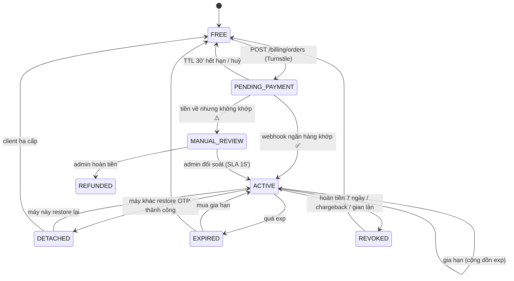
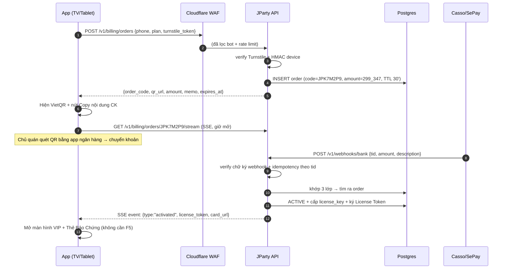

# JParty VIP — Kiến trúc hệ thống B2B cho quán nhậu

Tài liệu kiến trúc kỹ thuật + hướng dẫn lập trình cho luồng **No-Login Speed**: chủ quán mua và kích hoạt VIP trong 10–30 giây, không tài khoản, không mật khẩu.

> Tài liệu này mô tả **backend + license layer** sẽ thay thế hệ thống FREE/PRO/MAX hiện đang chạy hoàn toàn client-side (`js/subscription/plans.js`). Kiến trúc game, realtime và UI hiện có giữ nguyên; xem `docs/ARCHITECTURE.md`.

---

## 0. Tóm tắt điều hành

### 0.1 Ba quyết định kiến trúc cốt lõi

**① Tiền là cơ chế xác thực, không phải mật khẩu.**
Không có đường nào cấp VIP ngoài "tiền thật về tài khoản ngân hàng". Kẻ tấn công có thể giả API, giả device, giả fingerprint — nhưng không giả được một giao dịch ngân hàng. Điều này làm mô hình no-login *an toàn hơn* mô hình email/password thông thường, và cho phép ta nới lỏng mọi thứ khác để đổi lấy tốc độ.

**② License là một token ký offline, không phải một lần gọi API.**
Server cấp **License Token** ký bằng Ed25519 (chứa `license_id`, `device_uuid`, `tier`, `exp`, `epoch`). App xác minh chữ ký **offline** bằng public key nhúng sẵn. Wifi quán nhậu chập chờn → VIP vẫn chạy trong thời gian ân hạn (72h). Đây là yêu cầu bắt buộc cho F&B: app không được chết vì rớt mạng giữa bàn nhậu.

**③ Số điện thoại là danh tính khôi phục được; Device UUID chỉ là chỗ ngồi hiện tại.**
`subscription` thuộc về số điện thoại. Device chỉ *mượn* quyền. Đổi TV = chuyển chỗ ngồi, không mất hàng.

### 0.2 Những điểm trong yêu cầu cần điều chỉnh (đọc kỹ phần này)

| Yêu cầu gốc | Đánh giá | Thiết kế thay thế |
|---|---|---|
| "HMAC từ client fingerprint để **không cho gửi API bằng Postman/curl**" | ❌ **Không khả thi tuyệt đối.** Mọi secret nằm trong JS bundle đều trích xuất được; attacker chỉ cần đọc code rồi ký y hệt. | ✅ HMAC **per-device key** (server cấp lúc đăng ký, mỗi máy một key) → không chặn được attacker quyết tâm, nhưng **truy vết và thu hồi được** từng thiết bị, chặn replay, và chặn 100% script copy-paste. Lớp phòng thủ thật nằm ở Turnstile + rate limit + §0.1① |
| "FingerprintJS làm Device Identity" | ⚠️ Fingerprint là **xác suất**, đổi khi update trình duyệt, và là dữ liệu cá nhân theo NĐ13 | ✅ Danh tính = **UUID v4 ngẫu nhiên** (ổn định, ghi 3 nơi dự phòng). Fingerprint chỉ dùng làm **tín hiệu phát hiện gian lận** (nhiều UUID cùng một fingerprint → nghi vấn) |
| "Nội dung CK: `VIP [SĐT] [UUID_Short]`" | ⚠️ Rủi ro #1 của cả hệ thống: khách sửa nội dung, bank cắt ký tự, gõ tay sai | ✅ **Khớp 3 lớp**: mã đơn ngắn → số tiền duy nhất → hàng đợi đối soát thủ công. Không bao giờ để khách thấy màn hình im lặng |
| "Ngắt máy cũ ngay lập tức" | ⚠️ Nếu máy cũ đang giữa ván game thì mất mặt với khách của quán | ✅ Ngắt có **đếm ngược 60 giây** + thông báo rõ ràng, trừ khi admin ép ngắt |
| Chưa đề cập | 🔴 Thiếu | **Hóa đơn VAT điện tử** — khách B2B (quán nhậu có đăng ký kinh doanh) cần hóa đơn để hạch toán. Đây là yếu tố *trust* lớn hơn cả thẻ VIP điện tử |
| Chưa đề cập | 🔴 Thiếu | **NĐ 13/2023** về bảo vệ dữ liệu cá nhân — SĐT là dữ liệu cá nhân, cần thông báo mục đích + lưu trữ có mã hóa |

---

## 1. Mô hình định danh & License

```
┌─────────────────────┐        ┌──────────────────────┐       ┌────────────────────┐
│  Device             │ n   1  │  Shop (SĐT)          │ 1   n │  Subscription      │
│  device_uuid (PK)   ├───────►│  phone_hmac (UNIQUE) │◄──────┤  license_key       │
│  device_secret      │        │  phone_enc           │       │  tier, exp         │
│  fingerprint_hash   │        │                      │       │  active_device_uuid│
│  (tín hiệu abuse)   │        │                      │       │  active_epoch      │
└─────────────────────┘        └──────────────────────┘       └────────────────────┘
```

- **Device UUID**: `crypto.randomUUID()` sinh lần đầu mở app, ghi đồng thời vào **IndexedDB + localStorage + Cache API**; đọc lại theo thứ tự ưu tiên và tự vá lại các kho bị xóa. Không dùng cookie (bị chặn third-party, và ta không cần).
- **Device Secret**: 32 byte random **do server cấp** tại `POST /v1/devices/register`, lưu IndexedDB. Dùng để ký HMAC request (§6.3). Server thu hồi được từng device.
- **Fingerprint**: FingerprintJS (hoặc tự tính canvas+audio+fonts hash) → **chỉ** lưu hash, **chỉ** dùng cho `abuse_events`. Không bao giờ dùng để cấp quyền.
- **Phone**: lưu 2 cột — `phone_hmac` (HMAC-SHA256 với pepper, có index, để tra cứu) và `phone_enc` (AES-256-GCM, để hiển thị/liên hệ). Không lưu plaintext.

### License Token (cấp sau khi kích hoạt)

```jsonc
// Ed25519-signed, compact. Client verify offline bằng public key nhúng trong bundle.
{
  "lic": "JP-2026-K7M2P9XQ",   // license_key, hiện trên Thẻ VIP
  "sub": "ph_8f3a…",            // phone_hmac (không lộ SĐT)
  "dev": "a1b2c3d4-…",          // device_uuid được phép dùng
  "tier": "vip",
  "iat": 1790000000,
  "exp": 1792592000,            // hết hạn GÓI (vd 30 ngày)
  "hbx": 1790086400,            // hạn chót heartbeat: iat + 72h ân hạn offline
  "epo": 7                      // epoch — tăng mỗi lần đổi máy
}
```

Quy tắc client:
1. `now < exp` **và** chữ ký hợp lệ → VIP.
2. `now > hbx` → buộc online heartbeat; thất bại → về Free (vẫn giữ token để thử lại).
3. Heartbeat trả `epoch` khác → máy này đã bị thay thế → về Free (§4.2).

> **Vì sao không chỉ gọi API kiểm tra mỗi lần mở app?** Vì quán nhậu mất wifi lúc 9h tối thứ Bảy là chuyện bình thường, và "khách trả tiền rồi mà app báo hết hạn" là cách nhanh nhất để mất khách B2B.

---

## 2. Sơ đồ luồng dữ liệu & trạng thái

### 2.1 State machine của Subscription



### 2.2 Luồng mua VIP (happy path, mục tiêu ≤ 30 giây)



### 2.3 Luồng khôi phục (đổi TV / xóa cache)

```mermaid
sequenceDiagram
  autonumber
  participant B as Máy mới (B)
  participant API as JParty API
  participant ZNS as Zalo ZNS / SMS
  participant A as Máy cũ (A)
  B->>API: POST /v1/license/restore/request-otp {phone, turnstile}
  API->>API: rate limit: 3 OTP/SĐT/ngày, 5/IP/giờ
  API->>ZNS: gửi OTP 4 số (TTL 5', hash lưu DB)
  ZNS-->>B: (chủ quán đọc OTP trên Zalo)
  B->>API: POST /v1/license/restore/verify-otp {phone, otp}
  API->>API: epoch++ ; active_device_uuid = B
  API-->>B: License Token mới (epoch N+1)
  API-->>A: SSE/WS push: {type:"license_detached"}
  A->>A: Đếm ngược 60s → về Free
  Note over A: Nếu A offline: heartbeat kế tiếp trả 409 epoch_stale
```

---

## 3. Thanh toán VietQR & Webhook ngân hàng

### 3.1 Nội dung chuyển khoản — thiết kế chống sai sót

Trường `addInfo` của VietQR/Napas bị giới hạn độ dài và nhiều ngân hàng chuẩn hóa ký tự (bỏ dấu, cắt ký tự đặc biệt). Format đề xuất — **chỉ chữ IN HOA + số, không dấu, không ký tự đặc biệt**:

```
JP K7M2P9 4567
└┬┘ └──┬─┘ └─┬┘
 │     │     └─ 4 số cuối SĐT (giúp người đối soát thủ công nhận ra khách)
 │     └─────── mã đơn 6 ký tự, Crockford Base32 (bỏ I, L, O, U để tránh nhầm)
 └───────────── tiền tố cố định
```

So với format gốc `VIP [SĐT] [UUID_Short]`: ngắn hơn (an toàn với giới hạn độ dài), **không đưa trọn SĐT khách vào sao kê ngân hàng** (giảm bề mặt dữ liệu cá nhân), và mã đơn 6 ký tự Base32 = 1 tỷ tổ hợp, đủ chống trùng trong cửa sổ 30 phút.

### 3.2 Khớp giao dịch 3 lớp

> Đây là phần quyết định tỉ lệ kích hoạt tự động. Nếu chỉ khớp theo nội dung CK, thực tế sẽ rớt 5–15% đơn vì khách gõ tay hoặc sửa nội dung.

| Lớp | Cách khớp | Khi nào dùng |
|---|---|---|
| **L1 — Mã đơn** | Chuẩn hóa `description` (bỏ dấu, bỏ khoảng trắng, uppercase) → regex `JP([0-9A-HJ-NP-TV-Z]{6})` | Mặc định, ~90% đơn (khách quét QR nên nội dung tự điền) |
| **L2 — Số tiền duy nhất** | Mỗi đơn có số tiền **lẻ riêng**: `299_000 + random(0..999)` → `299_347`. Khớp `amount` chính xác trong cửa sổ ±2 giờ, chỉ khi đúng **một** đơn PENDING có số tiền đó | Khi khách xóa/gõ sai nội dung |
| **L3 — Hàng đợi thủ công** | Không khớp → `MANUAL_REVIEW` + cảnh báo Telegram cho admin + app hiện "Đã nhận chuyển khoản, đang xác nhận (≤15 phút)" kèm hotline | Phần còn lại. **Không bao giờ để màn hình im lặng** |

Ràng buộc DB bắt buộc để L2 an toàn:
```sql
-- Trong cùng một thời điểm, không được có 2 đơn PENDING cùng số tiền
CREATE UNIQUE INDEX uniq_pending_amount
  ON orders (amount_vnd) WHERE status = 'PENDING';
```
Khi tạo đơn, nếu `INSERT` vi phạm index này thì **thử lại với phần lẻ khác** (tối đa 5 lần). Dải 0–999 cho phép tối đa 1.000 đơn PENDING đồng thời trên mỗi mức giá — thừa cho quy mô hiện tại; khi vượt, mở rộng phần lẻ lên 4 chữ số. Lưu ý đặt các mức giá cách nhau > 1.000đ để hai gói khác nhau không đụng dải lẻ của nhau.

### 3.3 Bảo mật webhook

1. **Xác thực**: verify header chữ ký/secret-token của nhà cung cấp (Casso `Secure-Token`, SePay `Authorization: Apikey …`) bằng **so sánh hằng thời gian** (`timingSafeEqual`).
2. **IP allowlist** tại Cloudflare WAF cho route `/v1/webhooks/*`.
3. **Idempotency**: `UNIQUE(provider, provider_tx_id)` trên bảng `bank_transactions`. Webhook gửi lại → `INSERT … ON CONFLICT DO NOTHING` → trả `200` ngay, không kích hoạt lần hai.
4. **Ghi log thô trước, xử lý sau**: luôn `INSERT` payload gốc vào `bank_transactions` rồi mới match. Nếu logic match có bug, dữ liệu tiền vẫn còn nguyên để chạy lại.
5. **Trả 200 nhanh** (< 2s), xử lý nặng đẩy sang queue — tránh provider retry dồn.

---

## 4. Khôi phục VIP & Single Active Host

### 4.1 OTP

| Tham số | Giá trị | Lý do |
|---|---|---|
| Độ dài | 4 số | Yêu cầu của chủ quán: nhập nhanh trên remote TV |
| TTL | 5 phút | |
| Lưu trữ | `argon2id(otp + pepper)`, **không lưu plaintext** | |
| Số lần nhập sai | 5 → khóa challenge | Chống brute-force (4 số = 10.000 tổ hợp) |
| Rate limit | 3 OTP/SĐT/ngày · 5/IP/giờ · 20/device/ngày | Chặn bơm chi phí ZNS |
| Kênh | Zalo ZNS → fallback SMS brandname → fallback gọi tự động | ZNS rẻ nhất; SMS khi khách không dùng Zalo |

> 4 chữ số + 5 lần thử là đánh đổi có chủ ý. Rủi ro thực tế rất thấp vì kẻ tấn công phải **biết trước SĐT quán** và chỉ chiếm được quyền xem game — không có dữ liệu thanh toán hay thông tin khách hàng nào trong tài khoản. Nếu sau này VIP gắn với doanh thu/báo cáo, **phải nâng lên 6 số**.

### 4.2 Single Active Host — cơ chế `epoch`

```
subscriptions.active_epoch      INT   -- tăng 1 mỗi lần đổi thiết bị
subscriptions.active_device_uuid UUID
```

- License Token mang `epo`. Mỗi heartbeat (15 phút/lần) gửi kèm `epo`.
- Server: `epo < active_epoch` → `409 {reason: "epoch_stale"}` → client về Free.
- Đồng thời push realtime (SSE/WS) tới máy cũ để ngắt **tức thì** thay vì chờ tới 15 phút.
- **UX**: máy cũ hiện modal "Gói VIP vừa được mở trên thiết bị khác" + đếm ngược 60 giây (đủ để kết thúc ván đang chơi), rồi hạ cấp. Có nút "Đây là máy của tôi → lấy lại" (chạy lại luồng OTP).

### 4.3 Chống "lách" bằng cách xoay vòng thiết bị
`license_events` ghi mọi lần chuyển máy. Cảnh báo admin khi: > 3 lần chuyển/24h, hoặc 2 device_uuid khác nhau cùng `fingerprint_hash`, hoặc chuyển máy giữa 2 dải IP cách xa nhau trong < 10 phút. Xử lý: cảnh báo trước, khóa sau — **không bao giờ tự động khóa** một quán đang trả tiền.

---

## 5. Lớp niềm tin (Trust & Credibility)

### 5.1 Thẻ Bảo Chứng VIP Điện Tử

Server render PNG + PDF (satori → resvg, hoặc Cloudflare Browser Rendering), nội dung:

```
┌──────────────────────────────────────────┐
│  JPARTY · THẺ BẢO CHỨNG VIP              │
│                                          │
│  Quán:        0901 234 ***               │
│  License:     JP-2026-K7M2P9XQ           │
│  Kích hoạt:   02/10/2026 20:14           │
│  Hết hạn:     02/11/2026 23:59           │
│  Gói:         VIP 1 tháng                │
│                                   [QR]   │  ← quét ra trang xác minh công khai
│  Xác minh: jparty.vn/verify/K7M2P9XQ     │
└──────────────────────────────────────────┘
```

Điểm mấu chốt: **trang xác minh công khai** `GET /verify/{license_key}` (không cần đăng nhập, chỉ hiện trạng thái + ngày hết hạn + SĐT che một phần). Thẻ tự in ra thì ai cũng làm được; thẻ **tra cứu được trên domain của bạn** mới là bảo chứng.

Nút: **Tải ảnh** · **Tải PDF** · **Gửi qua Zalo** (ZNS kèm link thẻ).

### 5.2 Hóa đơn VAT điện tử ⭐ (bổ sung — quan trọng với B2B)

Quán nhậu có đăng ký kinh doanh cần hóa đơn để hạch toán chi phí. Thiếu cái này, nhiều quán sẽ không mua dù thích sản phẩm.
- Thêm bước tùy chọn sau kích hoạt: "Xuất hóa đơn VAT" → nhập MST + tên công ty + email.
- Tích hợp nhà cung cấp hóa đơn điện tử (Viettel S-Invoice / VNPT / MISA meInvoice) — Giai đoạn 2.
- Trước khi có tích hợp: tạo hóa đơn thủ công qua hàng đợi admin, SLA 24h. Vẫn tốt hơn là không có.

### 5.3 Minh bạch dịch vụ
- **Hoàn tiền 7 ngày**: hiện ngay dưới nút thanh toán. Kỹ thuật: trạng thái `REFUND_REQUESTED` → admin duyệt → `REVOKED` + hoàn khoản. Ghi `license_events` đầy đủ.
- **Hotline/Zalo 24/7**: nút nổi ở màn hình chính, `tel:` + `https://zalo.me/{oa_id}` — kèm `order_code`/`license_key` vào deep link để support biết ngay khách là ai.
- **Trang trạng thái** `status.jparty.vn` (uptime + sự cố). Rẻ, tăng độ tin cậy rõ rệt với khách B2B.
- Hiển thị **đúng** ngày hết hạn ở màn hình chính (không ẩn), nhắc gia hạn trước 3 ngày.

---

## 6. Chống abuse & kiểm soát chi phí

### 6.1 Bảng giới hạn (cấu hình, không hard-code)

| Giới hạn | Giá trị | Thực thi ở |
|---|---|---|
| WebSocket mỗi phòng | 1 host + 30 người chơi | Durable Object |
| Phòng đồng thời mỗi license | 2 | API + DO |
| Kết nối WS mỗi IP | 40 | Cloudflare + DO |
| Message mỗi kết nối | 3/giây (token bucket, burst 10) | DO |
| Kích thước message | ≤ 4 KB | DO |
| Phòng không tương tác | Đóng sau **15 phút** | DO alarm |
| Heartbeat license | 15 phút | API |
| Tạo đơn thanh toán | 5/device/giờ · 20/IP/giờ | Cloudflare Rate Limiting |
| OTP | 3/SĐT/ngày · 5/IP/giờ | API + Redis/KV |
| API chung | 60 req/phút/device | Cloudflare |

### 6.2 Kiến trúc realtime tiết kiệm chi phí

**Khuyến nghị: Cloudflare Durable Objects + WebSocket Hibernation.** Mỗi phòng = 1 DO:
- Phòng rảnh (sockets hibernate) **không tính tiền thời gian chạy** → một quán mở app cả tối mà không chơi gần như tốn 0đ. Đây chính là rủi ro chi phí lớn nhất mà yêu cầu đã nêu.
- Cô lập tự nhiên theo phòng: một quán spam không ảnh hưởng quán khác.
- `alarm()` làm bộ dọn phòng idle, không cần cron quét toàn cục.

Phương án thay thế nếu muốn tự chủ: 1 VPS + `uWebSockets.js` + Redis. Rẻ ở quy mô nhỏ nhưng phải tự lo scale, dọn socket chết và DDoS.

Giữ nguyên **mô hình host-authoritative** của app hiện tại: server chỉ **relay + áp giới hạn**, không chạy logic game → CPU/RAM gần như không tăng theo độ phức tạp game.

### 6.3 Ký request HMAC (và giới hạn thật của nó)

```
Canonical  = METHOD + "\n" + PATH + "\n" + SHA256(body) + "\n" + ts + "\n" + nonce
X-JP-Sign  = base64( HMAC-SHA256(device_secret, Canonical) )
X-JP-Device, X-JP-TS, X-JP-Nonce
```
- `|now - ts| ≤ 120s`; `nonce` lưu KV TTL 180s → chống replay.
- `device_secret` **do server cấp riêng từng máy** → thu hồi được, truy vết được.
- 🔴 **Nói thẳng**: attacker đọc được bundle vẫn ký được request hợp lệ. HMAC ở đây để **chặn script dùng lại request** và **gắn trách nhiệm theo thiết bị**, không phải để chứng minh "client thật". Lớp chặn thật là Turnstile (§6.4), rate limit, và quan trọng nhất: *không có tiền thì không có VIP*.

### 6.4 Cloudflare Turnstile
Chỉ gắn vào 2 endpoint **ghi DB / tốn tiền**: tạo đơn thanh toán và xin OTP. **Không** gắn vào endpoint game (thêm độ trễ, phá trải nghiệm). Dùng widget vô hình; verify server-side qua `/turnstile/v0/siteverify`.

### 6.5 WAF / DDoS
- Toàn bộ traffic qua Cloudflare (orange cloud). Chặn truy cập thẳng origin bằng Authenticated Origin Pulls hoặc Cloudflare Tunnel.
- Managed Ruleset + Bot Fight Mode.
- CORS: chỉ `https://jparty.vn` và subdomain. Webhook là ngoại lệ, bảo vệ bằng IP allowlist + chữ ký.
- Pending order TTL 30 phút + job dọn → DB không phình vì đơn rác.

---

## 7. Danh sách API Endpoint

Ký hiệu middleware: `TS`=Turnstile · `SIG`=HMAC device · `RL`=rate limit · `LIC`=yêu cầu license hợp lệ · `WH`=xác thực webhook

### 7.1 Thiết bị

**`POST /v1/devices/register`** — `RL(10/IP/h)`
```jsonc
// Request
{ "fingerprint_hash": "fp_9a8b…", "platform": "web", "app_version": "2.2.1" }
// 201
{ "device_uuid": "a1b2c3d4-…", "device_secret": "base64(32B)", "server_time": 1790000000 }
```
`device_secret` trả **đúng một lần**. Mất → đăng ký device mới (chi phí bằng 0 vì license thuộc về SĐT).

### 7.2 Thanh toán

**`POST /v1/billing/orders`** — `TS` `SIG` `RL(5/device/h, 20/IP/h)`
```jsonc
// Request
{ "phone": "0901234567", "plan_id": "vip_1m", "turnstile_token": "0.xxx" }
// 201
{
  "order_code": "K7M2P9",
  "amount_vnd": 299347,            // số tiền lẻ duy nhất (lớp khớp L2)
  "memo": "JP K7M2P9 4567",
  "qr_url": "https://img.vietqr.io/image/970436-1234567890-compact2.png?amount=299347&addInfo=JP%20K7M2P9%204567",
  "bank": { "name": "Vietcombank", "account_no": "1234567890", "account_name": "CONG TY JPARTY" },
  "expires_at": "2026-10-02T20:44:00+07:00"
}
```
> Luôn trả **cả số tài khoản dạng text** kèm QR: nhiều chủ quán chuyển khoản bằng Internet Banking trên máy tính, không quét QR được.

**`GET /v1/billing/orders/{code}/stream`** — `SIG` · **SSE**, tối đa 30 phút
```
event: status      data: {"status":"PENDING","seconds_left":1740}
event: activated   data: {"license_token":"eyJ…","license_key":"JP-2026-K7M2P9XQ","card_url":"/v1/license/card.png?t=…"}
event: review      data: {"status":"MANUAL_REVIEW","message":"Đã nhận chuyển khoản, đang xác nhận…","hotline":"0909…"}
```
Client **phải** có fallback polling `GET /v1/billing/orders/{code}` mỗi 5 giây (một số wifi quán chặn SSE).

**`POST /v1/webhooks/bank/{provider}`** — `WH` (không `SIG`, không CORS). Luôn trả `200` kể cả khi không khớp.

### 7.3 License

**`GET /v1/license`** — `SIG` → trạng thái hiện tại + token mới nếu còn hạn.

**`POST /v1/license/heartbeat`** — `SIG` `LIC` · gọi mỗi 15 phút
```jsonc
// Request
{ "epoch": 7, "room_count": 1 }
// 200 → gia hạn token (hbx mới)
{ "license_token": "eyJ…", "epoch": 7 }
// 409 → bị thay thế
{ "error": "epoch_stale", "message": "Gói VIP đang được mở ở thiết bị khác", "grace_seconds": 60 }
```

**`POST /v1/license/restore/request-otp`** — `TS` `SIG` `RL(3/phone/day, 5/IP/h)`
```jsonc
{ "phone": "0901234567", "turnstile_token": "0.xxx" }
// 200 — luôn trả giống nhau dù SĐT có tồn tại hay không (chống dò SĐT)
{ "challenge_id": "ch_…", "channel": "zns", "expires_in": 300, "masked_phone": "090****567" }
```

**`POST /v1/license/restore/verify-otp`** — `SIG` `RL(5 lần/challenge)`
```jsonc
{ "challenge_id": "ch_…", "otp": "4821" }
// 200
{ "license_token": "eyJ…", "license_key": "JP-2026-K7M2P9XQ", "epoch": 8, "detached_device": true }
// 401 { "error":"otp_invalid", "attempts_left": 3 }
```

**`GET /v1/license/card.{png|pdf}`** — `SIG` `LIC` → Thẻ Bảo Chứng.
**`POST /v1/license/card/send-zalo`** — `SIG` `LIC` `RL(3/day)`.
**`GET /verify/{license_key}`** — công khai, không auth, HTML + JSON. Trả tối thiểu: `status`, `activated_at`, `expires_at`, `masked_phone`.

**`POST /v1/license/refund-request`** — `SIG` `LIC` — chỉ trong 7 ngày đầu.

### 7.4 Phòng chơi

| Endpoint | Middleware | Mô tả |
|---|---|---|
| `POST /v1/rooms` | `SIG` `LIC` | Host tạo phòng → `{room_code, ws_url, ws_ticket}` |
| `GET /v1/rooms/{code}` | `RL` | Người chơi kiểm tra phòng tồn tại (trước khi mở WS) |
| `WS /v1/rooms/{code}?ticket=…` | ticket 1 lần, TTL 60s | Kênh game. Giới hạn theo §6.1 |
| `POST /v1/rooms/{code}/close` | `SIG` `LIC` | Host đóng phòng |

> Dùng **ws_ticket dùng-một-lần** thay vì gửi `device_secret` qua query string (query string bị ghi vào log).

---

## 8. Database Schema (PostgreSQL)

```sql
-- ─── Thiết bị ────────────────────────────────────────────────────────────
CREATE TABLE devices (
  device_uuid      UUID PRIMARY KEY,
  device_secret    BYTEA NOT NULL,                 -- 32B, mã hoá ở tầng ứng dụng
  fingerprint_hash TEXT,                           -- chỉ dùng phát hiện abuse
  platform         TEXT,
  app_version      TEXT,
  first_ip_cidr    INET,                           -- /24, không lưu IP đầy đủ (NĐ13)
  revoked_at       TIMESTAMPTZ,
  created_at       TIMESTAMPTZ NOT NULL DEFAULT now(),
  last_seen_at     TIMESTAMPTZ
);
CREATE INDEX ON devices (fingerprint_hash) WHERE fingerprint_hash IS NOT NULL;

-- ─── Quán (danh tính = SĐT) ──────────────────────────────────────────────
CREATE TABLE shops (
  shop_id     BIGSERIAL PRIMARY KEY,
  phone_hmac  TEXT NOT NULL UNIQUE,                -- HMAC-SHA256(phone, pepper) → tra cứu
  phone_enc   BYTEA NOT NULL,                      -- AES-256-GCM → hiển thị/liên hệ
  shop_name   TEXT,
  tax_code    TEXT,                                -- cho hoá đơn VAT
  zalo_opt_in BOOLEAN NOT NULL DEFAULT false,
  created_at  TIMESTAMPTZ NOT NULL DEFAULT now()
);

-- ─── Gói VIP ─────────────────────────────────────────────────────────────
CREATE TYPE sub_status AS ENUM
  ('ACTIVE','EXPIRED','REVOKED','REFUND_REQUESTED');

CREATE TABLE subscriptions (
  license_key        TEXT PRIMARY KEY,             -- JP-2026-K7M2P9XQ
  shop_id            BIGINT NOT NULL REFERENCES shops,
  tier               TEXT NOT NULL DEFAULT 'vip',
  status             sub_status NOT NULL DEFAULT 'ACTIVE',
  activated_at       TIMESTAMPTZ NOT NULL DEFAULT now(),
  expires_at         TIMESTAMPTZ NOT NULL,
  active_device_uuid UUID REFERENCES devices,
  active_epoch       INT NOT NULL DEFAULT 1,       -- tăng mỗi lần đổi máy
  last_heartbeat_at  TIMESTAMPTZ
);
-- Mỗi quán chỉ có tối đa 1 gói ACTIVE (partial unique index — không cần btree_gist)
CREATE UNIQUE INDEX one_active_sub_per_shop ON subscriptions (shop_id) WHERE status = 'ACTIVE';
CREATE INDEX ON subscriptions (shop_id);
CREATE INDEX ON subscriptions (expires_at) WHERE status = 'ACTIVE';

-- ─── Đơn hàng ────────────────────────────────────────────────────────────
CREATE TYPE order_status AS ENUM
  ('PENDING','PAID','EXPIRED','MANUAL_REVIEW','CANCELLED','REFUNDED');

CREATE TABLE orders (
  order_code   TEXT PRIMARY KEY,                   -- K7M2P9 (Crockford Base32)
  shop_id      BIGINT NOT NULL REFERENCES shops,
  device_uuid  UUID NOT NULL REFERENCES devices,
  plan_id      TEXT NOT NULL,
  amount_vnd   INT NOT NULL,                       -- đã cộng phần lẻ duy nhất
  memo         TEXT NOT NULL,
  status       order_status NOT NULL DEFAULT 'PENDING',
  bank_tx_id   BIGINT,                             -- → bank_transactions
  created_at   TIMESTAMPTZ NOT NULL DEFAULT now(),
  expires_at   TIMESTAMPTZ NOT NULL,
  paid_at      TIMESTAMPTZ
);
-- Bắt buộc để lớp khớp L2 (theo số tiền) không nhập nhằng
CREATE UNIQUE INDEX uniq_pending_amount ON orders (amount_vnd) WHERE status = 'PENDING';
CREATE INDEX ON orders (status, expires_at);

-- ─── Giao dịch ngân hàng thô (nguồn sự thật, ghi trước khi xử lý) ────────
CREATE TABLE bank_transactions (
  id              BIGSERIAL PRIMARY KEY,
  provider        TEXT NOT NULL,                   -- casso | sepay
  provider_tx_id  TEXT NOT NULL,
  amount_vnd      INT NOT NULL,
  description     TEXT NOT NULL,
  account_no      TEXT,
  occurred_at     TIMESTAMPTZ NOT NULL,
  raw             JSONB NOT NULL,
  matched_order   TEXT REFERENCES orders,
  match_layer     SMALLINT,                        -- 1=mã đơn 2=số tiền 3=thủ công
  received_at     TIMESTAMPTZ NOT NULL DEFAULT now(),
  UNIQUE (provider, provider_tx_id)                -- idempotency
);
CREATE INDEX ON bank_transactions (matched_order) WHERE matched_order IS NULL;

-- ─── OTP ─────────────────────────────────────────────────────────────────
CREATE TABLE otp_challenges (
  challenge_id TEXT PRIMARY KEY,
  shop_id      BIGINT NOT NULL REFERENCES shops,
  device_uuid  UUID NOT NULL REFERENCES devices,
  otp_hash     TEXT NOT NULL,                      -- argon2id, KHÔNG lưu plaintext
  channel      TEXT NOT NULL,                      -- zns | sms | call
  attempts     SMALLINT NOT NULL DEFAULT 0,
  consumed_at  TIMESTAMPTZ,
  expires_at   TIMESTAMPTZ NOT NULL,
  created_at   TIMESTAMPTZ NOT NULL DEFAULT now()
);
CREATE INDEX ON otp_challenges (shop_id, created_at DESC);

-- ─── Phiên chơi (phân tích + thực thi giới hạn) ──────────────────────────
CREATE TABLE game_sessions (
  room_code     TEXT PRIMARY KEY,
  license_key   TEXT REFERENCES subscriptions,
  host_device   UUID NOT NULL REFERENCES devices,
  game_id       TEXT,                              -- quiz-flags, battle-quick…
  peak_players  SMALLINT NOT NULL DEFAULT 0,
  msg_count     INT NOT NULL DEFAULT 0,
  started_at    TIMESTAMPTZ NOT NULL DEFAULT now(),
  last_activity TIMESTAMPTZ NOT NULL DEFAULT now(),
  closed_at     TIMESTAMPTZ,
  close_reason  TEXT                               -- host | idle_timeout | license_lost
);
CREATE INDEX ON game_sessions (license_key, started_at DESC);
CREATE INDEX ON game_sessions (last_activity) WHERE closed_at IS NULL;

-- ─── Nhật ký license (bằng chứng khi tranh chấp) ─────────────────────────
CREATE TABLE license_events (
  id          BIGSERIAL PRIMARY KEY,
  license_key TEXT NOT NULL REFERENCES subscriptions,
  event       TEXT NOT NULL,                       -- activated|renewed|transferred|detached|revoked|refunded
  from_device UUID, to_device UUID,
  actor       TEXT NOT NULL,                       -- system | admin:<id> | shop
  meta        JSONB,
  created_at  TIMESTAMPTZ NOT NULL DEFAULT now()
);

-- ─── Tín hiệu abuse ──────────────────────────────────────────────────────
CREATE TABLE abuse_events (
  id          BIGSERIAL PRIMARY KEY,
  kind        TEXT NOT NULL,                       -- rate_limit|epoch_thrash|fp_collision|ws_flood
  device_uuid UUID, ip_cidr INET, license_key TEXT,
  detail      JSONB,
  created_at  TIMESTAMPTZ NOT NULL DEFAULT now()
);
```

**Chính sách lưu trữ (NĐ 13/2023):** `bank_transactions.raw` giữ 24 tháng (chứng từ kế toán); `abuse_events` và `otp_challenges` đã dùng xóa sau 90 ngày; `devices.first_ip_cidr` chỉ lưu /24.

---

## 9. Pseudocode

### 9.1 Webhook ngân hàng → kích hoạt VIP

```python
POST /v1/webhooks/bank/{provider}

def handle_bank_webhook(provider, headers, raw_body):
    # 1) XÁC THỰC — so sánh hằng thời gian, tránh timing attack
    if not constant_time_equals(headers.secret_token, SECRETS[provider]):
        return 401
    payload = parse_json(raw_body)

    for tx in payload.transactions:          # provider có thể gửi theo lô
        # 2) IDEMPOTENCY — ghi thô trước, trả 200 ngay cả khi đã có
        row, inserted = db.insert_ignore("bank_transactions", {
            provider, provider_tx_id: tx.id, amount_vnd: tx.amount,
            description: tx.description, occurred_at: tx.when, raw: tx,
        }, on_conflict=("provider", "provider_tx_id"))
        if not inserted:
            continue                          # webhook gửi lại → bỏ qua, KHÔNG kích hoạt lần 2
        if tx.amount <= 0:
            continue                          # giao dịch ghi nợ (tiền ra) → bỏ qua

        order = match_order(tx)               # §3.2
        if order is None:
            db.update(row, match_layer=3)
            alert_admin_telegram(row)         # hàng đợi đối soát, SLA 15'
            notify_possible_shops(tx)         # app hiện "đang xác nhận…" nếu đoán được đơn
            continue

        activate(order, row)

    return 200                                # LUÔN 200 — tránh provider retry dồn


def match_order(tx) -> Order | None:
    text = normalize(tx.description)          # bỏ dấu, bỏ khoảng trắng, UPPERCASE

    # L1 — mã đơn trong nội dung chuyển khoản (~90%)
    m = regex_search(r"JP([0-9A-HJ-NP-TV-Z]{6})", text)
    if m:
        o = db.find_one("orders", order_code=m[1], status="PENDING")
        if o and o.amount_vnd == tx.amount and tx.occurred_at <= o.expires_at + 2h:
            db.update(tx.row, match_layer=1)
            return o

    # L2 — số tiền lẻ duy nhất, chỉ chấp nhận khi khớp đúng MỘT đơn
    candidates = db.find("orders", status="PENDING", amount_vnd=tx.amount,
                         created_at__gte=tx.occurred_at - 2h)
    if len(candidates) == 1:
        db.update(tx.row, match_layer=2)
        return candidates[0]

    return None                               # → L3 thủ công


def activate(order, bank_row):
    with db.transaction():                    # nguyên tử: tiền và quyền cùng vào/cùng ra
        o = db.select_for_update("orders", order_code=order.order_code)
        if o.status != "PENDING":             # chống race giữa 2 webhook song song
            return
        db.update(o, status="PAID", paid_at=now(), bank_tx_id=bank_row.id)
        db.update(bank_row, matched_order=o.order_code)

        sub = db.find_one("subscriptions", shop_id=o.shop_id, status="ACTIVE")
        if sub:                               # GIA HẠN — cộng dồn từ hạn cũ nếu chưa hết
            base = max(sub.expires_at, now())
            db.update(sub, expires_at=base + PLAN[o.plan_id].duration,
                           active_device_uuid=o.device_uuid)
            event = "renewed"
        else:                                 # KÍCH HOẠT MỚI
            sub = db.insert("subscriptions", {
                license_key: new_license_key(),  # JP-2026-XXXXXXXX
                shop_id: o.shop_id, tier: PLAN[o.plan_id].tier,
                expires_at: now() + PLAN[o.plan_id].duration,
                active_device_uuid: o.device_uuid, active_epoch: 1,
            })
            event = "activated"

        db.insert("license_events", {license_key: sub.license_key, event: event,
                                     to_device: o.device_uuid, actor: "system",
                                     meta: {order: o.order_code, amount: o.amount_vnd}})

    token = sign_license_token(sub, o.device_uuid)      # Ed25519, §1
    sse_publish(f"order:{o.order_code}", {              # kích hoạt tức thì, không cần F5
        type: "activated", license_token: token,
        license_key: sub.license_key, card_url: card_url(sub),
    })
    enqueue(send_zalo_receipt, sub)                     # biên nhận — không chặn luồng chính
```

### 9.2 Tự ngắt phòng không hoạt động (Durable Object)

```js
// Mỗi phòng = 1 Durable Object. Hibernation API ⇒ socket rảnh gần như không tốn tiền.
const IDLE_MS = 15 * 60_000, MAX_PLAYERS = 30, MAX_BYTES = 4096;
const RATE = { capacity: 10, refillPerSec: 3 };        // token bucket

export class Room {
  async fetch(req) {
    const role = await verifyTicket(req);              // ticket 1 lần, TTL 60s
    const peers = this.ctx.getWebSockets();
    if (role === 'host' && peers.some(w => tag(w) === 'host')) return err(409, 'host_exists');
    if (role === 'player' && peers.filter(w => tag(w) === 'player').length >= MAX_PLAYERS)
      return err(429, 'room_full');

    const [client, server] = Object.values(new WebSocketPair());
    // acceptWebSocket (KHÔNG phải server.accept) ⇒ cho phép hibernate
    this.ctx.acceptWebSocket(server, [role]);
    server.serializeAttachment({ tokens: RATE.capacity, ts: Date.now() });
    await this.touch();
    return new Response(null, { status: 101, webSocket: client });
  }

  async webSocketMessage(ws, msg) {
    if (msg.length > MAX_BYTES) return ws.close(1009, 'too_large');

    // Token bucket — chống auto-clicker. Trạng thái nằm trong attachment ⇒ sống qua hibernation.
    const a = ws.deserializeAttachment();
    const now = Date.now();
    a.tokens = Math.min(RATE.capacity, a.tokens + ((now - a.ts) / 1000) * RATE.refillPerSec);
    a.ts = now;
    if (a.tokens < 1) { ws.serializeAttachment(a); return ws.close(1008, 'rate_limited'); }
    a.tokens -= 1; ws.serializeAttachment(a);

    // Host là nguồn sự thật: chỉ host được broadcast state; player chỉ gửi ý định cho host.
    if (tag(ws) === 'host') this.broadcastToPlayers(msg);
    else this.sendToHost(msg);
    await this.touch();
  }

  async touch() {                                      // hẹn giờ dọn phòng
    await this.ctx.storage.put('lastActivity', Date.now());
    await this.ctx.storage.setAlarm(Date.now() + IDLE_MS);
  }

  async alarm() {
    const last = (await this.ctx.storage.get('lastActivity')) ?? 0;
    const idle = Date.now() - last;
    if (idle < IDLE_MS)                                 // có hoạt động sau khi đặt alarm
      return this.ctx.storage.setAlarm(last + IDLE_MS);

    for (const ws of this.ctx.getWebSockets())
      ws.close(1001, 'idle_timeout');                   // giải phóng RAM/bandwidth
    await reportSessionClosed(this.roomCode, 'idle_timeout');
    await this.ctx.storage.deleteAll();
  }

  webSocketClose(ws) {                                  // host thoát ⇒ đóng cả phòng
    if (tag(ws) === 'host')
      for (const p of this.ctx.getWebSockets()) p.close(1001, 'host_left');
  }
}
```

### 9.3 Heartbeat & Single Active Host

```python
POST /v1/license/heartbeat     # client gọi mỗi 15 phút

def heartbeat(device_uuid, body):
    sub = db.find_one("subscriptions", active_device_uuid=device_uuid, status="ACTIVE")

    if sub is None or body.epoch < sub.active_epoch:
        # Máy này đã bị thay thế bởi máy khác (hoặc gói bị thu hồi)
        log_abuse_if_frequent(device_uuid, "epoch_thrash")
        return 409, {error: "epoch_stale",
                     message: "Gói VIP đang được mở ở thiết bị khác",
                     grace_seconds: 60}        # đủ để kết thúc ván đang chơi

    if sub.expires_at < now():
        return 402, {error: "expired", renew_url: "/upgrade"}

    db.update(sub, last_heartbeat_at=now())
    # Token mới đẩy hbx thêm 72h ⇒ app chịu được mất mạng 3 ngày
    return 200, {license_token: sign_license_token(sub, device_uuid), epoch: sub.active_epoch}


POST /v1/license/restore/verify-otp

def verify_otp(device_uuid, challenge_id, otp):
    ch = db.select_for_update("otp_challenges", challenge_id=challenge_id)
    if ch is None or ch.consumed_at or ch.expires_at < now(): return 410
    if ch.attempts >= 5:                      # khoá brute-force
        return 429, {error: "too_many_attempts"}
    if not argon2_verify(ch.otp_hash, otp + PEPPER):
        db.increment(ch, "attempts")
        return 401, {error: "otp_invalid", attempts_left: 5 - ch.attempts - 1}

    with db.transaction():
        db.update(ch, consumed_at=now())
        sub = db.select_for_update("subscriptions", shop_id=ch.shop_id, status="ACTIVE")
        old_device = sub.active_device_uuid
        db.update(sub, active_device_uuid=device_uuid,
                       active_epoch=sub.active_epoch + 1)     # ⇐ vô hiệu hoá máy cũ
        db.insert("license_events", {license_key: sub.license_key, event: "transferred",
                                     from_device: old_device, to_device: device_uuid,
                                     actor: "shop"})

    if old_device and old_device != device_uuid:
        push_to_device(old_device, {type: "license_detached", grace_seconds: 60})  # ngắt tức thì

    return 200, {license_token: sign_license_token(sub, device_uuid),
                 license_key: sub.license_key, epoch: sub.active_epoch}
```

---

## 10. Hạ tầng & chi phí ước tính (quy mô khởi đầu)

| Thành phần | Lựa chọn | Chi phí/tháng (ước tính) |
|---|---|---|
| CDN / WAF / Rate limit | Cloudflare Free → Pro | 0 – 20 $ |
| API + Realtime | Cloudflare Workers + Durable Objects | ~5 $ + usage |
| CSDL | Neon / Supabase Postgres | 0 – 25 $ |
| KV (nonce, rate limit) | Cloudflare KV / Upstash Redis | 0 – 10 $ |
| Đối soát ngân hàng | Casso / SePay | theo bảng giá nhà cung cấp |
| OTP | Zalo ZNS (+ SMS dự phòng) | theo lượng · **giới hạn cứng 3/SĐT/ngày** |
| Lưu trữ thẻ VIP | Cloudflare R2 | ~0 $ |

Chi phí biến động nguy hiểm nhất là **OTP** và **socket rảnh**. Cả hai đã được chặn bằng rate limit cứng (§6.1) và DO hibernation (§6.2). Nên đặt **Billing Alert** ở mức 2× chi phí dự kiến cho mọi dịch vụ trả theo usage.

---

## 11. Pháp lý & tuân thủ (tham khảo, không phải tư vấn pháp lý)

- **NĐ 13/2023/NĐ-CP**: SĐT là dữ liệu cá nhân. Cần (a) thông báo mục đích xử lý trước khi thu thập — một dòng ngay dưới ô nhập SĐT là đủ, (b) chính sách bảo mật công khai, (c) cơ chế để khách yêu cầu xóa dữ liệu, (d) thời hạn lưu trữ rõ ràng.
- **Hóa đơn**: bán hàng cho doanh nghiệp cần hóa đơn điện tử theo NĐ 123/2020. Nên chuẩn bị từ đầu (§5.2).
- **Điều khoản sử dụng**: nêu rõ chính sách 1 thiết bị host tại một thời điểm và quy trình hoàn tiền 7 ngày — tránh tranh chấp.
- Nội dung game cho quán nhậu: giữ nguyên nguyên tắc hiện có — **uống rượu luôn là tùy chọn**, mọi thử thách có phiên bản không rượu (`ChallengeCard`, xem `docs/ARCHITECTURE.md`).

---

## 12. Lộ trình triển khai

| Giai đoạn | Phạm vi | Tiêu chí hoàn thành |
|---|---|---|
| **P0 — Nền móng** (1 tuần) | `devices`, HMAC ký request, License Token Ed25519, client verify offline, thay `js/subscription/plans.js` đọc token | Bật/tắt VIP bằng token thủ công hoạt động đúng |
| **P1 — Thanh toán** (1–2 tuần) | Orders + VietQR + webhook + khớp 3 lớp + SSE + hàng đợi admin | Mua thật từ 3 ngân hàng khác nhau, tự kích hoạt < 30s |
| **P2 — Khôi phục & Trust** (1 tuần) | OTP ZNS, epoch/single-host, Thẻ VIP + trang `/verify`, hotline | Đổi TV < 60s; thẻ tra cứu được công khai |
| **P3 — Chống abuse** (1 tuần) | Turnstile, Cloudflare rate limit, DO giới hạn + idle reaper, `abuse_events` | Chịu được test tải 100 socket giả; chi phí phòng rảnh ≈ 0 |
| **P4 — Vận hành** | Dashboard admin, đối soát thủ công, hoàn tiền, hóa đơn VAT, status page | Support xử lý 1 ca đối soát < 2 phút |

### Tích hợp với codebase hiện tại
- `js/subscription/plans.js`: `Entitlements.hasFeature()` giữ nguyên chữ ký hàm; chỉ đổi nguồn của `sub` — từ `localStorage` sang **License Token đã verify chữ ký**. Toàn bộ UI khóa/mở tính năng không phải sửa.
- `IS_DEV` + dev plan switcher: giữ nguyên cho môi trường dev, **chặn cứng ở production build**.
- `js/realtime/*`: thay PeerJS bằng WebSocket tới Durable Object; mô hình host-authoritative và shape của `STATE` snapshot giữ nguyên.
- Tier hiện tại `free/pro/max` → ánh xạ `free` ↔ Free, `max` ↔ VIP quán (venue branding, QR join, big screen). `pro` giữ cho khách lẻ.
